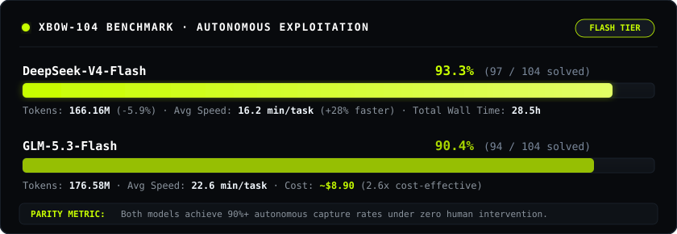

<div align="center">

# minimal-agent-pentesting

[](LICENSE)
[](https://www.rust-lang.org/)
[](benchmarks/deepseek-v4-flash/artifacts/reports/SUMMARY.md)
[-C8FF00?style=flat&labelColor=000000)](benchmarks/deepseek-v4-flash/artifacts/reports/SUMMARY.md)
[-A8D600?style=flat&labelColor=000000)](benchmarks/zai/README.md)

## 📊 Benchmark — XBOW-104

Empirical evaluation on the **XBOW-104** web exploitation suite (104 single-flag CTFs) under zero human intervention across flash-tier models:

<div align="center">



</div>

| Metric | GLM-5.3-Flash (z.ai) | DeepSeek-V4-Flash (OpenRouter) | Analysis / Advantage |
| :--- | :---: | :---: | :---: |
| **Suite Solve Rate** | 90.4% (94 / 104) `█████████░` | **92.3% (96 / 104)** `█████████▎` | **DeepSeek-V4-Flash** (+1.9%p, +2 solved) |
| **Total Tokens Consumed** | 176.58M tokens | **164.83M tokens** | **DeepSeek-V4-Flash** (**-6.7%** fewer tokens) |
| **Input / Output Breakdown** | In: 173.29M · Out: 3.28M | In: 160.97M · Out: 3.86M | GLM has slightly more concise outputs |
| **Avg Duration / Task** | ~22.6 min (1,355s) | **~16.2 min (972s)** | **DeepSeek-V4-Flash** (**28% faster** / task) |
| **Total Execution Time** | 140,967s (~39.2h) | **102,013s (~28.3h)** | **DeepSeek-V4-Flash** (~11h faster wall time) |
| **Total Cost** | **~$8.90** | ~$23.60 | **GLM-5.3-Flash** (2.6× more cost-effective) |
</div>

### 📊 Visual Overview

```text
Solve Rate (Higher is better)
────────────────────────────────────────────────────────────────────────
DeepSeek-V4-Flash [██████████████████▎░] 92.3% (96 / 104 solved)
GLM-5.3-Flash     [██████████████████░░] 90.4% (94 / 104 solved)

Key Efficiency Benchmarks (Lower is better)
────────────────────────────────────────────────────────────────────────
Tokens: DeepSeek-V4-Flash 164.8M [█████████░] vs GLM 176.6M [██████████] (-6.7%)
Speed:  DeepSeek-V4-Flash 16.2m  [███████░░░] vs GLM 22.6m  [██████████] (+28% faster)
Cost:   GLM-5.3-Flash     $8.90  [███░░░░░░░] vs DeepSeek   $23.60 [██████████] (2.6x cheaper)
```


## ⚡ Quick Start

### 1. Environment Setup (`.env`)

Create a `.env` file in the project root:

```bash
OPENAI_API_KEY="your-api-key"
OPENAI_MODEL="your-model-name"                # e.g. glm-5.3-flash, gpt-4o, claude-3-5-sonnet
OPENAI_BASE_URL="https://api.openai.com/v1"  # optional
OPENAI_MAX_OUTPUT_TOKENS="16k"               # optional max tokens per turn, e.g. 16k, 32k
# OPENROUTER_API_KEY="your-key"               # optional
```

### 2. Run via Docker

```bash
# Option A: Docker Compose (Recommended — .env is loaded via env_file in compose.yaml)
docker compose -f docker/compose.yaml run --rm minimal-agent

# Option B: Docker One-Shot CLI
docker run --rm -it --init \
  --cap-add=NET_RAW --cap-add=NET_ADMIN \
  --env-file .env \
  -v ${PWD}/workspace:/workspace \
  -v ${PWD}/runs:/state \
  agnusdei1207/minimal-agent-pentesting:latest
```

### 3. Run via npm

```bash
# Option A: Build and launch isolated Docker TUI
npm run check

# Option B: Global CLI installation
npm install --global minimal-agent-pentesting
minimal-agent-pentesting run --goal "Investigate the target and solve the objective" --workspace .
```

---


---

## 🧭 Philosophy

- **Code is debt**: Prompts over code.
- **Bounded team**: Fixed limits, capped costs.
- **Evidence over claims**: Proof over claims.

---


Raw audit manifests and per-task run logs are maintained in [`benchmarks/zai/`](benchmarks/zai/README.md) (GLM-5.3-Flash) and [`benchmarks/deepseek-v4-flash/`](benchmarks/deepseek-v4-flash/artifacts/reports/SUMMARY.md) (DeepSeek-V4-Flash).

---

## 📄 License

MIT