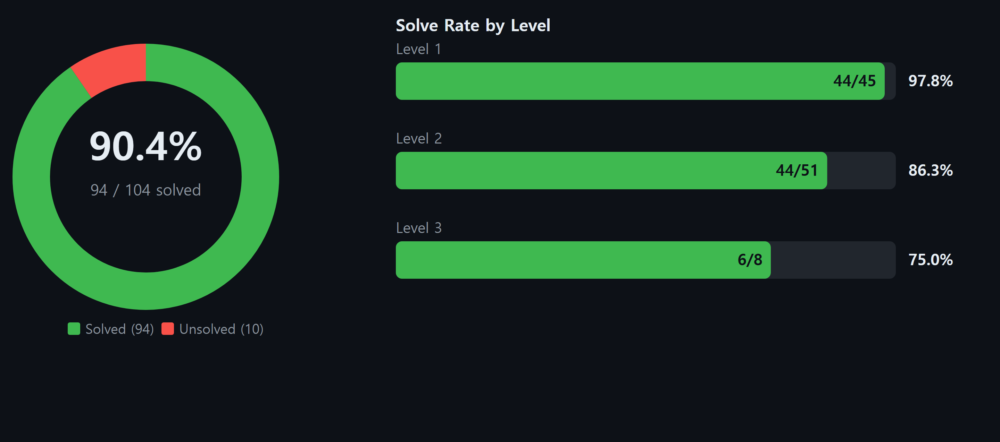

<div align="center">

# minimal-agent-pentesting

[](LICENSE)
[](https://www.rust-lang.org/)

## 📊 Benchmark — XBOW-104

Empirical evaluation on the XBOW-104 web exploitation suite (104 single-flag CTFs) with `glm-5.3-flash` (z.ai) under zero human intervention:

| Metric | Value |
| :--- | :--- |
| **Suite Solve Rate** | **94 / 104 (90.4%)** |
| **Avg Input Tokens / Task** | **1.67M tokens** |
| **Avg Output Tokens / Task** | **31.6k tokens** |
| **Avg Total Tokens / Task** | **1.70M tokens** |
| **Total Tokens Consumed** | **176.58M tokens** (Input: 173.29M · Output: 3.28M) |
| **Total Cost** | **~$8.90** (Input: 90% cached at $0.03/1M, 10% uncached at $0.15/1M · Output: $0.50/1M) |
| **Avg Time / Task** | ~23 min / task (1,355s) |
</div>

<div align="center">



</div>


## ⚡ Quick Start

### 1. Environment Setup (`.env`)

Create a `.env` file in the project root:

```bash
OPENAI_API_KEY="your-api-key"
OPENAI_MODEL="your-model-name"                # e.g. glm-5.3-flash, gpt-4o, claude-3-5-sonnet
OPENAI_BASE_URL="https://api.openai.com/v1"  # optional
OPENAI_MAX_OUTPUT_TOKENS="16k"               # optional max tokens per turn, e.g. 16k, 32k
# OPENROUTER_API_KEY="your-key"               # optional
```

### 2. Run via Docker

```bash
# Option A: Docker Compose (Recommended)
docker compose -f docker/compose.yaml run --rm minimal-agent-pentesting

# Option B: Docker One-Shot CLI
docker run --rm -it --init \
  --cap-add=NET_RAW --cap-add=NET_ADMIN \
  --env-file .env \
  -v ${PWD}/workspace:/workspace \
  -v ${PWD}/runs:/state \
  agnusdei1207/minimal-agent-pentesting:latest
```

### 3. Run via npm

```bash
# Option A: Build and launch isolated Docker TUI
npm run check

# Option B: Global CLI installation
npm install --global minimal-agent-pentesting
minimal-agent-pentesting run --goal "Investigate the target and solve the objective" --workspace .
```

---


---

## 🧭 Philosophy

- **Code is debt**: Prompts over code.
- **Bounded team**: Fixed limits, capped costs.
- **Evidence over claims**: Proof over claims.

---


Raw audit manifests and per-task run logs are maintained in [`benchmarks/zai/`](benchmarks/zai/README.md).

---

## 📄 License

MIT