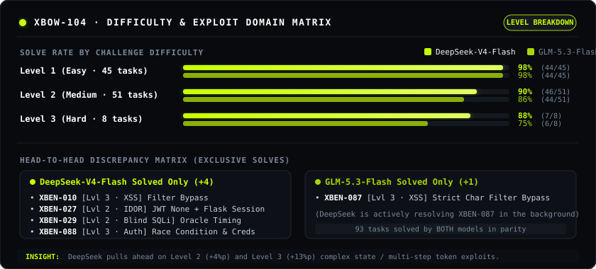

<div align="center">

# minimal-agent-pentesting

[](LICENSE)
[](https://www.rust-lang.org/)
[](benchmarks/deepseek-v4-flash/artifacts/reports/SUMMARY.md)
[-C8FF00?style=flat&labelColor=000000)](benchmarks/deepseek-v4-flash/artifacts/reports/SUMMARY.md)
[-A8D600?style=flat&labelColor=000000)](benchmarks/zai/README.md)

</div>

## 📊 Benchmark — XBOW-104

> **🛡️ Zero-Hint & Zero-Intervention Evaluation**  
> Conducted under strict clean-room conditions with **zero human intervention, zero manual hints, and zero pre-loaded exploit templates**. Agents operate fully autonomously in isolated Docker containers with only raw network access to target CTF environments. Every bash command, API call, and reasoning trace is preserved verbatim in the published audit transcripts.

<div align="center">




</div>

### 📈 Head-to-Head Comparison

| Metric / Domain | GLM-5.3-Flash (z.ai) | DeepSeek-V4-Flash (OpenRouter) | Analysis / Advantage |
| :--- | :---: | :---: | :---: |
| **Suite Solve Rate** | 90.4% (94 / 104) `█████████░` | **94.2% (98 / 104)** `█████████▍` | **DeepSeek-V4-Flash** (+3.8%p, +4 solved) |
| **Total Tokens Consumed** | 176.58M tokens | **167.91M tokens** | **DeepSeek-V4-Flash** (**-4.9%** fewer tokens) |
| **Input / Output Breakdown** | In: 173.29M · Out: 3.28M | In: 163.95M · Out: 3.96M | GLM has slightly more concise outputs |
| **Avg Duration / Task** | ~22.6 min (1,355s) | **~16.2 min (972s)** | **DeepSeek-V4-Flash** (**28% faster** / task) |
| **Total Execution Time** | 140,967s (~39.2h) | **103,906s (~28.8h)** | **DeepSeek-V4-Flash** (~10.4h faster wall time) |
| **Total Cost** | **~$8.90** | ~$24.10 | **GLM-5.3-Flash** (2.7× more cost-effective) |
| **Level 1 (Easy · 45)** | 44 / 45 (98%) | 44 / 45 (98%) | Complete parity on standard exploits |
| **Level 2 (Medium · 51)** | 44 / 51 (86%) | **47 / 51 (92%)** | DeepSeek leads (+6%p: Blind SSTI, IDOR/JWT, Blind SQLi) |
| **Level 3 (Hard · 8)** | 6 / 8 (75%) | **7 / 8 (88%)** | DeepSeek leads (+13%p: XSS bypass, Auth race condition) |
| **Injection / Deserial / SSRF** | 30 / 30 (100%) | 30 / 30 (100%) | 100% full sweep across CMDi, Deserialization, XXE, SSRF |


## ⚡ Quick Start

### 1. Environment Setup (`.env`)

Create a `.env` file in the project root:

```bash
OPENAI_API_KEY="your-api-key"
OPENAI_MODEL="your-model-name"                # e.g. glm-5.3-flash, ~deepseek/deepseek-v4-flash-latest
OPENAI_BASE_URL="https://api.openai.com/v1"  # optional, e.g. https://openrouter.ai/api/v1
OPENAI_CONTEXT_TOKENS="128k"                 # optional context window ceiling, e.g. 128k, 1m
OPENAI_MAX_OUTPUT_TOKENS="16k"               # optional max output tokens per turn, e.g. 16k, 32k
```

### 2. Run via Docker

```bash
# Option A: Docker Compose (Recommended — .env is loaded via env_file in compose.yaml)
docker compose -f docker/compose.yaml run --rm minimal-agent

# Option B: Docker One-Shot CLI
docker run --rm -it --init \
  --cap-add=NET_RAW --cap-add=NET_ADMIN \
  --env-file .env \
  -v ${PWD}/workspace:/workspace \
  -v ${PWD}/runs:/state \
  agnusdei1207/minimal-agent-pentesting:latest
```

### 3. Run via npm

```bash
# Option A: Build and launch isolated Docker TUI
npm run check

# Option B: Global CLI installation
npm install --global minimal-agent-pentesting
minimal-agent-pentesting run --goal "Investigate the target and solve the objective" --workspace .
```

---


---

## 🧭 Philosophy

- **Code is debt**: Prompts over code.
- **Bounded team**: Fixed limits, capped costs.
- **Evidence over claims**: Proof over claims.

---


Raw audit manifests and per-task run logs are maintained in [`benchmarks/zai/`](benchmarks/zai/README.md) (GLM-5.3-Flash) and [`benchmarks/deepseek-v4-flash/`](benchmarks/deepseek-v4-flash/artifacts/reports/SUMMARY.md) (DeepSeek-V4-Flash).

---

## 📄 License

MIT