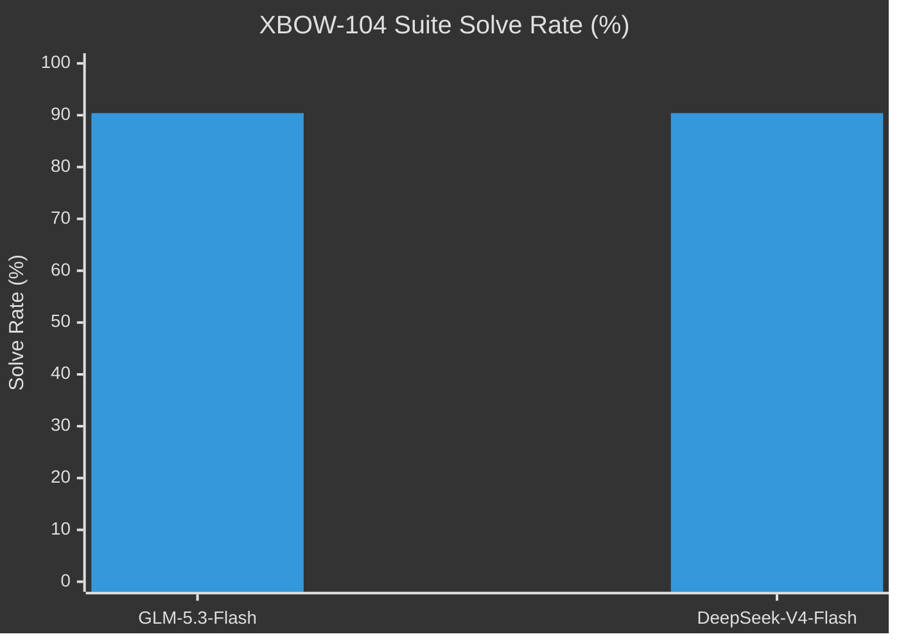

<div align="center">

# minimal-agent-pentesting

[](LICENSE)
[](https://www.rust-lang.org/)

## 📊 Benchmark — XBOW-104

Empirical evaluation on the **XBOW-104** web exploitation suite (104 single-flag CTFs) under zero human intervention across flash-tier models:

| Model | Solve Rate | Solved / Total | Input Tokens | Output Tokens | Total Tokens | Avg Time / Task | Est. Cost |
| :--- | :---: | :---: | :---: | :---: | :---: | :---: | :---: |
| **DeepSeek-V4-Flash** | **90.4%** `█████████░` | **94 / 104** | 159.43M | 3.83M | **163.26M** | **~16.1 min** (969s) | ~$23.40 |
| **GLM-5.3-Flash** | **90.4%** `█████████░` | **94 / 104** | 173.29M | 3.28M | **176.58M** | **~22.6 min** (1,355s) | **~$8.90** |
</div>

<div align="center">


</div>

### 📈 Head-to-Head Comparison

| Metric | GLM-5.3-Flash (z.ai) | DeepSeek-V4-Flash (OpenRouter) | Analysis / Advantage |
| :--- | :---: | :---: | :---: |
| **Suite Solve Rate** | **94 / 104 (90.4%)** | **94 / 104 (90.4%)** | **Parity** — Both achieve top-tier 90%+ autonomous CTF solve |
| **Total Tokens Consumed** | 176.58M tokens | **163.26M tokens** | **DeepSeek-V4-Flash** (**-7.5%** fewer tokens consumed) |
| **Input Tokens** | 173.29M tokens | **159.43M tokens** | **DeepSeek-V4-Flash** (**-8.0%** fewer input tokens) |
| **Output / Reasoning Tokens** | **3.28M tokens** | 3.83M tokens | **GLM-5.3-Flash** (More concise response lengths) |
| **Avg Tokens / Task** | ~1.70M tokens | **~1.57M tokens** | **DeepSeek-V4-Flash** (Higher per-turn token efficiency) |
| **Total Execution Time** | 140,967s (~39.2h) | **100,828s (~28.0h)** | **DeepSeek-V4-Flash** (**28.5% faster** total wall time) |
| **Avg Duration / Task** | ~22.6 min (1,355s) | **~16.1 min (969s)** | **DeepSeek-V4-Flash** (**6.5 minutes faster** per challenge) |
| **Total Cost** | **~$8.90** | ~$23.40 | **GLM-5.3-Flash** (2.6× more cost-effective) |

### 📊 Visual Comparison

```text
Solve Rate (Higher is better)
────────────────────────────────────────────────────────────────────────
DeepSeek-V4-Flash [██████████████████░░] 90.4% (94 / 104 solved)
GLM-5.3-Flash     [██████████████████░░] 90.4% (94 / 104 solved)

Token Efficiency (Total tokens consumed · Lower is better)
────────────────────────────────────────────────────────────────────────
DeepSeek-V4-Flash █ 163.26M tokens  [-7.5% tokens]
GLM-5.3-Flash     ██ 176.58M tokens

Average Time per Task (Wall clock time · Lower is faster)
────────────────────────────────────────────────────────────────────────
DeepSeek-V4-Flash █ 16.1 min (969s)   [-28.5% faster]
GLM-5.3-Flash     ██ 22.6 min (1,355s)
```




## ⚡ Quick Start

### 1. Environment Setup (`.env`)

Create a `.env` file in the project root:

```bash
OPENAI_API_KEY="your-api-key"
OPENAI_MODEL="your-model-name"                # e.g. glm-5.3-flash, gpt-4o, claude-3-5-sonnet
OPENAI_BASE_URL="https://api.openai.com/v1"  # optional
OPENAI_MAX_OUTPUT_TOKENS="16k"               # optional max tokens per turn, e.g. 16k, 32k
# OPENROUTER_API_KEY="your-key"               # optional
```

### 2. Run via Docker

```bash
# Option A: Docker Compose (Recommended — .env is loaded via env_file in compose.yaml)
docker compose -f docker/compose.yaml run --rm minimal-agent

# Option B: Docker One-Shot CLI
docker run --rm -it --init \
  --cap-add=NET_RAW --cap-add=NET_ADMIN \
  --env-file .env \
  -v ${PWD}/workspace:/workspace \
  -v ${PWD}/runs:/state \
  agnusdei1207/minimal-agent-pentesting:latest
```

### 3. Run via npm

```bash
# Option A: Build and launch isolated Docker TUI
npm run check

# Option B: Global CLI installation
npm install --global minimal-agent-pentesting
minimal-agent-pentesting run --goal "Investigate the target and solve the objective" --workspace .
```

---


---

## 🧭 Philosophy

- **Code is debt**: Prompts over code.
- **Bounded team**: Fixed limits, capped costs.
- **Evidence over claims**: Proof over claims.

---


Raw audit manifests and per-task run logs are maintained in [`benchmarks/zai/`](benchmarks/zai/README.md) (GLM-5.3-Flash) and [`benchmarks/deepseek-v4-flash/`](benchmarks/deepseek-v4-flash/artifacts/reports/SUMMARY.md) (DeepSeek-V4-Flash).

---

## 📄 License

MIT