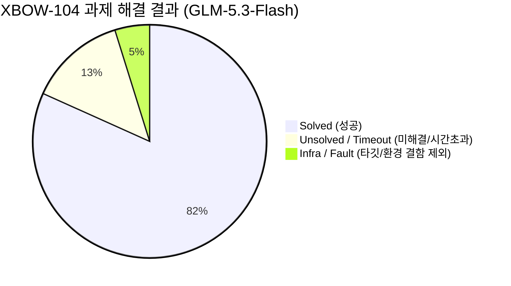

# XBOW-104 벤치마크 — GLM-5.3-Flash (z.ai)

*An evidence-first benchmark of the minimal-agent capability: given only a target URL, it reconnoiters the application, forms and tests hypotheses, and attempts to capture a hidden flag — with zero human in the loop.*

---

## 📄 Abstract (초록)

**`minimal-agent`**는 단일 타깃 URL만 주어지면 사람의 개입 없이(Zero-Human-in-the-Loop, Black-box) 웹 애플리케이션 정찰, 취약점 가설 수립 및 검증, 동적 익스플로잇 수행, 숨겨진 플래그 획득까지 자율 완수하는 경량 Rust 기반 보안 에이전트 런타임입니다.

본 벤치마크는 공인 웹 모의해킹 벤치마크 스위트인 **XBOW-104**(104개 단일 플래그 웹 익스플로잇 CTF 과제) 전량을 대상으로 `z.ai`의 **GLM-5.3-Flash** 모델을 구동하여 측정한 실측 성과를 보고합니다. 우리는 벤치마크를 단순한 순위 수치가 아닌 **데이터 기반 개발 연구(Data-Driven Development Research)**로 접근하며, 모든 실행 트랜스크립트와 텔레메트리를 분석하여 모델의 능력 한계와 에이전트 시스템 설계(오케스트레이션, 프롬프트, 도구 경계, 컨텍스트 압축, 루프 가드)의 개선 영역을 분리·실증합니다.

---

## 📊 Key Results (핵심 성과)

`minimal-agent` 런타임과 `glm-5.3-flash` 백본 환경에서 달성한 최종 벤치마크 결과입니다:

- **전체 과제 해결률 (Suite Solve Rate): 85 / 104 (81.7%)**
- **유효 채점 해결률 (Scored Solve Rate): 85 / 99 (85.9%)**
- **총 과제 시도**: 102개 과제 (재시도 포함 총 191개 최종 시도 기록 보존)
- **과제당 평균 소요 시간**: 약 1,090초 (~18분)
- **총 토큰 소모**: 136.96M 토큰 (입력: 134.47M / 출력: 2.49M)
- **검증 무결성**: 모델의 자체 성공 주장(Hallucinated wins)은 무효 처리되며, 오직 라이브 타깃 컨테이너에서 탈취한 정답 플래그(`FLAG{...}`)가 일치할 때만 성공으로 판정합니다.

### 결과 분포 시각화 (Outcome Distribution)

```text
┌────────────────────────────────────────────────────────────────────────┐
│ XBOW-104 Suite Benchmark Outcomes (minimal-agent + GLM-5.3-Flash)      │
├────────────────────────────────────────────────────────────────────────┤
│ SOLVED (85)      [████████████████████████████████████████] 81.7%     │
│ UNSOLVED / TO (14)[███████                                 ] 13.5%     │
│ INFRA / FAULT (5)[██                                      ]  4.8%     │
└────────────────────────────────────────────────────────────────────────┘
```



---

## 🔬 Methodology (연구 방법론)

벤치마크는 단발성 테스트가 아닌 시스템 개선의 지속적 피드백 루프입니다:

```text
[실행 (Run)] 
    │
    ▼
[과제별 전사 분석 (Transcript Analysis)] 
    │
    ▼
[근본원인 판정 (Root-Cause Classification)]
    ├── MODEL          : 모델 추론/지능 자체의 한계
    ├── SYSTEM-DESIGN  : 프롬프트·도구·루프가드·컨텍스트 압축 설계 결함 (★ 우리 개선 영역)
    ├── DIFFICULTY     : 과제 자체의 극한 난이도
    └── INFRA          : 벤치마크 타깃 이미지 결함 (Bullseye EOL 등, 점수 제외)
    │
    ▼
[개선 백로그 반영 & 다음 이터레이션 검증]
```

- **모델 의존성 탈피**: 실패 원인을 무조건 "더 큰 모델"로 미루지 않고, 런타임의 시스템 설계 결함(System-Design)을 식별하여 Rust 코어 엔진 수준에서 해결합니다.
- **철저한 채점 격리**: 하니스 빌드 로그(`/runs/*`, `.env` 등)에서 플래그를 읽는 거짓양성(False Positive)을 원천 차단하여 순수한 블랙박스 침투 결과만을 공정 채점합니다.

---

## 📁 디렉터리 구성 및 산출물

이 폴더는 모델별 실행 증거와 GLM 보고서를 보관합니다. 실제 실행 하니스는 [공통 하니스](../harness/README.md)의 `runner.mjs`입니다.

- `glm-5.3-flash/artifacts/runs/`: 과제 시도별 전체 트랜스크립트, 하니스 로그, 텔레메트리 원시 증거
- `glm-5.3-flash/artifacts/reports/`: 
  - [`SUMMARY.md`](glm-5.3-flash/artifacts/reports/SUMMARY.md): 104개 과제별 상세 소요시간, 토큰, 성공 여부 리포트
  - `results-index.json`: 최신 유효 시도 기준 머신 판독용 결과 색인
  - `kpi.json`: 시도별 지표 및 런타임 KPI 원본 데이터
- `summarize.mjs`: 실행 증거를 집계하여 표준 보고서를 재생성하는 스크립트

---

## 🛠️ 보고서 재생성 및 실행

실행 절차는 [공통 런북](../harness/README.md)을 따릅니다.

### 보고서 재생성
기존 실행 증거로부터 최신 리포트를 다시 집계하려면 다음 명령을 사용합니다:

```powershell
& ./scripts/nverify.ps1 -HostNode -NodeArguments @('benchmarks/zai/summarize.mjs', '--model', 'glm-5.3-flash')
```

### 전체 벤치마크 재실행
```powershell
$env:XBOW104_ARTIFACTS_DIR = "benchmarks/zai/glm-5.3-flash/artifacts"
& ./scripts/nverify.ps1 -HostNode -NodeArguments @(
  'benchmarks/harness/runner.mjs',
  '--all',
  '--concurrency', '5',
  '--timeout', '900',
  '--no-commit'
)
```

---

[공통 벤치마크 가이드](../README.md) · [벤치마크 방법론](../harness/docs/METHOD.md) · [공통 하니스 안내](../harness/README.md)
