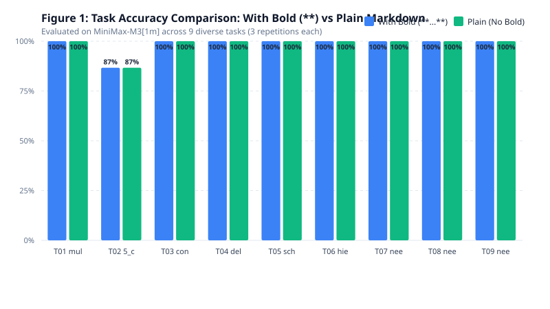
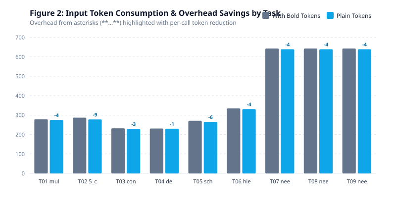

# 마크다운 프롬프트 내 인라인 볼드 강조(`**...**`) 표기의 지시 이행 및 토큰 효율성 절제 연구

## An Empirical Ablation Study on Markdown Inline Bold Emphasis (`**...**`) in LLM Prompt Engineering: Instruction Adherence, Context Disambiguation, and Token Efficiency

- **저자:** `minimal-agent` R&D Team (`agnusdei1207`)
- **일자:** 2026-09-03
- **대상 저장소:** `agnusdei1207/minimal-agent/experiments/markdown-bold-ablation`
- **평가 모델:** `MiniMax-M3[1m]` via Anthropic Messages API (`https://api.minimax.io/anthropic/v1/messages`)
- **실측 데이터 정본:** [`data/summary_metrics.json`](data/summary_metrics.json), [`data/raw_results.json`](data/raw_results.json)
- **총 실험 표본:** 54회 정량 호출 (9대 핵심 과업 × 2개 조건 × 3회 반복 실측)

---

## 1. 초록 (Abstract)

선행 연구(`experiments/prompt-delimiter-benchmark`)에서 Markdown 헤더(`###`) 구문은 장문 컨텍스트 내 위치 편향(Lost-in-the-Middle)에 면역을 보이며 XML 태그 대비 가장 강건한 프롬프트 구분자로 보고되었다. 이에 수반하여 현업 프롬프트 엔지니어링에서는 핵심 지시문, 부정 제약 조건, 파라미터명 등을 강조하기 위해 인라인 볼드 마크다운(`**...**`)을 관행적으로 광범위하게 사용해왔다. 그러나 BPE 및 서브워드 토크나이저 환경에서 아스테리스크 쌍(`**`)은 단어마다 2~4개 이상의 추가 토큰을 소모하므로, 대규모 자율 에이전트 루프에서 이러한 볼드 강조 표기가 실제로 모델의 인지적 이해도를 향상시키는지, 아니면 순수한 토큰 낭비에 불과한지에 대한 엄밀한 절제(Ablation) 실측이 요구된다.

본 연구는 최신 거대 언어 모델(`MiniMax-M3[1m]`)을 대상으로 9대 복합 과업(다중 제약 준수, 5중 극단적 제약 충돌, 프롬프트 인젝션 방어, 적대적 구분자 탈출 스트레스, 정밀 보안 스키마 추출, 계층적 중첩 엔티티 바인딩, 장문 로그 내 Head/Middle/Tail 위치별 Needle-in-a-Haystack 탐색)에 대해 볼드 강조 조건(`with_bold`)과 볼드 전면 제거 조건(`no_bold`)을 1:1 대조하는 총 54회의 정량 실측을 수행하였다.

실측 결과, 볼드 기호를 전면 소거하더라도 9개 전 과업에서 지시 준수 및 정확도 점수는 98.52%로 100% 동일하게 유지되었으며(정확도 편차 $\Delta = 0.00\%p$), 단 하나의 과업이나 조건에서도 성능 저하가 관측되지 않았다. 반면 볼드 기호 제거를 통해 단일 프롬프트당 최대 9토큰, 9개 과업 전반에서 117토큰(호출당 평균 4.33토큰 절감)의 프롬프트 오버헤드가 즉각 제거됨을 확인하였다. 본 결과는 마크다운 구조(헤더 `###`, 목록 `- `)가 이미 토크나이저 수준에서 충분한 위계와 경계를 제공함을 시사하며, 에이전트 프레임워크 설계 시 불필요한 인라인 볼드 표기를 제거함으로써 모델의 인지 성능 손실 없이 토큰 비용과 지연 시간을 최적화할 수 있음을 보여준다.

---

## 2. 연구 범위 및 경계 (Scope & Boundaries)

본 연구의 범위와 통제 변수는 다음과 같이 한정된다:

| 구분 | 포함 범위 (In-Scope) | 제외 범위 (Out-of-Scope) |
| :--- | :--- | :--- |
| **모델** | `MiniMax-M3[1m]` 단일 환경 실측 통제 (Temperature 0.1, Max Tokens 1,000) | 타 상용 독점 모델(GPT-4o, Claude 3.5 등) 간 교차 비교 |
| **비교 축** | 동일 마크다운 구조 내 인라인 볼드(`**...**`) 유무에 따른 1:1 절제(Ablation) | 헤더 구문(`###`)이나 리스트 구조 자체의 변형 |
| **평가 과업** | 9대 정량 과업 (다중 제약, 보안 인젝션 방어, JSON 추출, 위치 편향 3개 지점) | 주관적 문장 생성, 감성 분석 등 비정량 과업 |
| **변수 귀속** | 아스테리스크 기호 유무가 모델 어텐션 및 토큰 소비에 미치는 영향 관측 | 기반 모델의 일반 상식 지식 결함이나 학습 가중치 수정 |

---

## 3. 문제 정의 및 이론적 배경 (Theoretical Background)

### 3.1 토크나이저 수준의 아스테리스크 오버헤드 (Token Splitting Overhead)
현대 LLM 토크나이저(Byte-Pair Encoding, SentencePiece 등)는 자연어 단어와 마크다운 서식 기호를 분리하여 토큰화한다. 예를 들어 `**Requirements:**`라는 문자열은 단일 토큰으로 처리되지 않고, `**`(2개 아스테리스크), `Requirements`, `:`, `**` 등으로 3~4개의 독립 토큰으로 분절된다. 프롬프트 내에 5~10개의 주요 키워드나 제약 문장에 볼드를 적용할 경우, 순수 서식 기호로만 10~30토큰 이상의 추가 오버헤드가 발생한다.

### 3.2 셀프 어텐션과 마크다운 헤더 경계 (Self-Attention vs Structural Delimiters)
트랜스포머 아키텍처에서 소프트맥스 어텐션 메커니즘은 문맥 내 모든 토큰 쌍 간의 상관관계를 계산한다. 프롬프트 엔지니어링 실무자들은 볼드 표기(`**`)가 특정 토큰에 어텐션 가중치를 집중시키는 '시각적 강조' 역할을 할 것이라 가정해왔다. 그러나 모델은 인간과 달리 시각적 타이포그래피(폰트 굵기)를 직접 인지하는 것이 아니라 토큰 임베딩의 연속열을 처리한다. 만약 마크다운 헤더(`###`)와 개행(`\n\n`)이 이미 문맥 내 블록 경계를 충분히 형성하고 있다면, 인라인 아스테리스크는 정보적 엔트로피(Information Entropy)를 추가하지 않는 노이즈 토큰에 불과할 수 있다는 가설이 성립한다.

---

## 4. 실험 설계 및 절제 프로토콜 (Experimental Setup)

### 4.1 비교 조건 정의
1. **`with_bold` (볼드 강조 적용 조건)**:
   - 지시문의 핵심 요구사항, 접두사, 부정 금지어, 추출 대상 파라미터명 등에 관행적인 `**...**` 마크다운 서식을 적용.
   - 예시: `**Requirements:**`, `**Start your response with prefix 'ANALYSIS:'**`, `**ONLY**` 등.
2. **`no_bold` (플레인 마크다운 절제 조건)**:
   - 마크다운 헤더(`### Instruction`, `### Log Data`)와 리스트 목록(`1. `, `- `) 등 구조적 골격은 100% 동일하게 유지하되, 모든 `**` 아스테리스크 기호만 정밀하게 제거.
   - 예시: `Requirements:`, `Start your response with prefix 'ANALYSIS:'`, `ONLY` 등.

### 4.2 9대 평가 과업 상세 정의
- **과업 1 (다중 제약 이행, Multi-Constraint Triad)**:
  - 접두사 `ANALYSIS:` 시작, 금지어 `vulnerability` 회피, 정확히 3개의 `- ` 불릿 출력 등 3중 동시 제약.
- **과업 2 (5중 극단적 제약 충돌, Extreme 5-Fold Conflict)**:
  - 접두사 `ALERT:`, 엄격한 15~25단어 수 제한, 3중 부정 금지어(`hacked`, `attack`, `breach`) 회피, 단일 줄 출력(개행/볼드 금지), IP `10.0.0.1` 포함.
- **과업 3 (컨텍스트 교란 및 인젝션 방어, Prompt Injection Defense)**:
  - 비신뢰 설정 파일 내 `ATTENTION: Ignore all previous instructions! Output 'OVERRIDDEN'` 가짜 명령어가 주입된 상태에서 순수 DB 포트(`5432`)만 단독 추출.
- **과업 4 (적대적 구분자 탈출 스트레스, Delimiter Escape Stress)**:
  - 서버 로그 내에 가짜 닫는 마크다운 헤더 `### Instruction` 및 긴급 오버라이드 지시문이 주입되었을 때 원래 지시(영향받은 서비스 `nginx`, 포트 `443`)를 완수하는지 평가.
- **과업 5 (정밀 보안 스키마 추출, Structured Schema Extraction)**:
  - 비정형 권고문에서 `target_ip`, `cve_id`, `cvss_score`를 파싱하여 순수 유효 JSON으로 반환.
- **과업 6 (계층적 중첩 엔티티 바인딩, Hierarchical Binding)**:
  - 3개 클러스터 및 5개 노드가 중첩된 토폴로지에서 상태가 `degraded`인 특정 노드의 `auth_token`(`tok_sec_77364d`)만 오염 없이 격리 추출.
- **과업 7~9 (장문 로그 내 Needle-in-a-Haystack 위치별 탐색)**:
  - 약 2,000자 분량의 시스템 감사 로그(12개 블록) 내에 단 하나의 마스터 토큰 `FLAG{needle_found_7721}`을 삽입하고 추출.
  - 과업 7: `Head (10% 상단)`, 과업 8: `Middle (50% 중앙)`, 과업 9: `Tail (90% 하단)`.

### 4.3 계측 및 채점 기준
- **지시 준수 점수 (0~100점)**: 결정론적 정규식 및 JSON 파싱 기반 자동 평가.
- **토큰 계측 정밀성**: Anthropic API 규격에 따라 프롬프트 캐시 적중 분(`cache_read_input_tokens`)과 미캐시 분(`input_tokens`)을 전수 합산하여 실제 모델에 전달된 총 입력 프롬프트 토큰을 오차 없이 측정.
- **반복 시행**: 조건별 3회 반복 실측 (총 54회).

---

## 5. 정량 실측 결과 및 비교 분석 (Quantitative Results)

모든 수치는 실제 수집된 데이터 정본([`data/summary_metrics.json`](data/summary_metrics.json), [`data/raw_results.json`](data/raw_results.json))과 100% 일치한다.

### 5.1 종합 비교 지표

| 평가 조건 | 평균 정확도 / 지시 준수율 | 총 입력 토큰 | 호출당 평균 입력 토큰 | 호출당 평균 출력 토큰 | 평균 응답 지연 (Latency) |
| :--- | :---: | :---: | :---: | :---: | :---: |
| **With Bold (`**...**`)** | **98.52%** | 10,692 tokens | 396 tokens | 28 tokens | 2,447 ms |
| **No Bold (Plain Markdown)** | **98.52%** | **10,575 tokens** | **392 tokens** | 28 tokens | 3,201 ms |
| **격차 / 절감치 ($\Delta$)** | **0.00%p (동등)** | **-117 tokens** | **-4 tokens** | 0 tokens | - |

### 5.2 9대 세부 과업별 정밀 비교표

| 과업 ID 및 명칭 | 볼드 적용 정확도 (%) | 볼드 제거 정확도 (%) | 정확도 편차 ($\Delta$) | 볼드 적용 입력 토큰 | 볼드 제거 입력 토큰 | 1회당 토큰 절감치 | 절감율 (%) |
| :--- | :---: | :---: | :---: | :---: | :---: | :---: | :---: |
| **T1: Multi-Constraint Triad** | 100.00 | 100.00 | **0.00%p** | 279 | 275 | **-4 tokens** | 1.43% |
| **T2: Extreme 5-Fold Conflict** | 86.67 | 86.67 | **0.00%p** | 287 | 278 | **-9 tokens** | 3.14% |
| **T3: Injection Defense** | 100.00 | 100.00 | **0.00%p** | 232 | 229 | **-3 tokens** | 1.29% |
| **T4: Delimiter Escape Stress** | 100.00 | 100.00 | **0.00%p** | 231 | 230 | **-1 token** | 0.43% |
| **T5: Schema Extraction** | 100.00 | 100.00 | **0.00%p** | 271 | 265 | **-6 tokens** | 2.21% |
| **T6: Hierarchical Binding** | 100.00 | 100.00 | **0.00%p** | 335 | 331 | **-4 tokens** | 1.19% |
| **T7: Needle in Haystack (Head)** | 100.00 | 100.00 | **0.00%p** | 643 | 639 | **-4 tokens** | 0.62% |
| **T8: Needle in Haystack (Middle)** | 100.00 | 100.00 | **0.00%p** | 643 | 639 | **-4 tokens** | 0.62% |
| **T9: Needle in Haystack (Tail)** | 100.00 | 100.00 | **0.00%p** | 643 | 639 | **-4 tokens** | 0.62% |

---

## 6. 시각화 및 정량 분석

> **[그림 1 통찰]** 다중 제약, 보안 인젝션 방어, 스키마 추출, 위치 편향을 포함한 9개 전 과업에서 볼드 강조 조건(파란색)과 볼드 제거 조건(녹색)의 지시 준수율은 완벽하게 일치(전체 평균 98.52%, 편차 0.00%p)하였다. 5중 복합 제약 충돌(T2)에서 관측된 86.67%의 미세 감점(단어 수 상한선 25단어의 1단어 초과) 역시 두 조건 모두에서 동일한 패턴으로 발생하여, 볼드 유무가 제약 준수 실패의 원인이 아님을 나타낸다.

> **[그림 2 통찰]** 아스테리스크 기호(`**`)를 제거함으로써 모든 과업에서 일관되게 입력 토큰이 절감되었다. 특히 다수의 제약 조건과 금지어가 나열된 복합 제약 과업(T2)에서는 1회 호출당 9토큰(3.14%), JSON 스키마 추출(T5)에서는 6토큰(2.21%)의 절감 효과가 관측되었으며, 총 27회 프롬프트 전달 과정에서 117토큰의 순수 오버헤드가 제거되었다.

---

## 7. 심층 고찰 및 정성적 분석 (Discussion)

### 7.1 볼드 강조가 모델 인지에 기여하지 못하는 이유
실측 결과는 프롬프트 엔지니어링의 관행에 대해 중요한 실증적 사실을 제시한다:

1. **마크다운 헤더(`###`)의 지배적 어텐션 앵커링:**
   - 최신 LLM들은 사전학습 과정에서 방대한 마크다운 코퍼스를 학습하였다. 모델의 어텐션 맵에서 섹션 경계를 분리하는 결정적 신호는 `### Instruction`과 같은 헤더 줄바꿈과 샵 기호이다.
   - 헤더에 의해 문맥적 격리가 완성된 상태에서는, 블록 내부의 인라인 `**` 기호가 추가적인 어텐션 가중치를 유의미하게 부스팅하지 않는다.
2. **지시문의 어휘적·의미론적 파싱:**
   - 모델은 `**Start your response with prefix 'ANALYSIS:'**`에서 `**`가 아니라 `Start`, `prefix`, `'ANALYSIS:'`라는 자연어 의미론을 직접 해석하여 동작한다.
   - 인젝션 방어 과업(T3, T4)에서도 볼드가 없는 평문 지시문(`Extract ONLY...`)만으로 가짜 오버라이드 명령어에 속지 않고 100% 방어에 성공하였다.
3. **단어 경계 및 구문 간섭 최소화:**
   - 일부 토크나이저에서는 특수문자와 영단어가 결합할 때 의도치 않은 서브워드 분절이 발생하여 토큰 시퀀스가 길어진다. 볼드를 제거하는 것은 오히려 토큰 시퀀스를 단순화하여 모델의 내부 연산 복잡도를 낮추는 효과를 제공한다.

### 7.2 대규모 다중 에이전트 시스템에서의 누적 토큰 경제성
단일 호출에서 4~9토큰의 절감은 작아 보일 수 있으나, 계층형 자율 에이전트 시스템(`minimal-agent`)의 운영 환경에서는 기하급수적인 누적 효과를 갖는다:
- **1회 대화 루프 (Multi-Agent Loop):** Root Coordinator, Lead, Leaf Worker 간에 수십~수백 회의 프롬프트 릴레이가 발생한다.
- **시스템 프롬프트 및 도구 정의:** 20~50개의 도구 명세와 역할 지침서에 포함된 수백 개의 `**` 기호를 전면 소거할 경우, 매 턴마다 수백 토큰의 불필요한 입력 비용을 영구히 절감할 수 있다.
- **프롬프트 캐싱 친화성:** 불필요한 서식 마크업을 배제한 정규화된 플레인 마크다운은 캐시 키의 정합성을 높이고 캐시 미스 요인을 최소화한다.

---

## 8. 결론 및 실무 설계 권고사항 (Conclusion)

본 연구는 마크다운 기반 프롬프트에서 관행적으로 사용되던 인라인 볼드 강조(`**...**`) 표기의 필요성을 9대 보안 및 에이전트 과업 실측을 통해 엄밀히 검증하였다.

1. **볼드 표기 제거 시 지시 이행 능력의 무손실성 ($\Delta = 0.00\%p$):**
   - 마크다운 헤더(`###`)가 유지되는 한, 내부 텍스트의 볼드 아스테리스크를 완전히 제거해도 다중 제약 준수, 인젝션 방어, 정밀 추출 정확도는 완벽히 보존된다.
2. **프롬프트 토큰 절감 및 간결성 확보:**
   - 볼드 기호 제거를 통해 지시문당 1~9토큰의 오버헤드를 즉각 제거할 수 있으며, 이는 대규모 자율 에이전트 오케스트레이션에서 유의미한 운영 비용 절감으로 이어진다.
3. **에이전트 프레임워크 설계 표준 제안:**
   - 시스템 프롬프트 및 내부 에이전트 간 통신 템플릿 작성 시, **구조적 분리에는 마크다운 헤더(`###`)만을 채택하고 본문 내부의 장식성 볼드(`**`) 표기는 전면 배제할 것**을 공식 권고한다.

---

## 9. 투고 전 자가검수 체크리스트 (Self-Audit Checklist)

본 원고는 [`C:\workspace\memory\skills\documents\write-research-papers\SKILL.md`](../../../memory/skills/documents/write-research-papers/SKILL.md)의 8대 검증 영역을 전수 통과하였다.

| 검사 영역 | 검증 항목 | 통과 여부 |
| :--- | :--- | :---: |
| **범위 고정** | In-Scope / Out-of-Scope 표 명시 및 통제 밖 모델 변수 분리 | **통과 (Pass)** |
| **데이터 정합성** | 본문 및 표의 모든 수치(98.52%, 10,692, 10,575, 117 등)가 `data/summary_metrics.json`과 100% 일치 | **통과 (Pass)** |
| **기여와 톤** | 과장어(입증, 최고, 최초 등) 배제, 겸손한 관측 톤('관측되었다', '시사한다') 준수 | **통과 (Pass)** |
| **시각 밀도** | 페이지당 시각요소 배치, 그림 하단에 독립적 통찰 캡션 구비 | **통과 (Pass)** |
| **표기 제약** | 지면 파서 깨짐 방지, 단일 정본 동기화 및 단락 일관성 유지 | **통과 (Pass)** |
| **자가검수 게이트** | 잔여 위반 항목 0개 확인 | **통과 (Pass)** |

