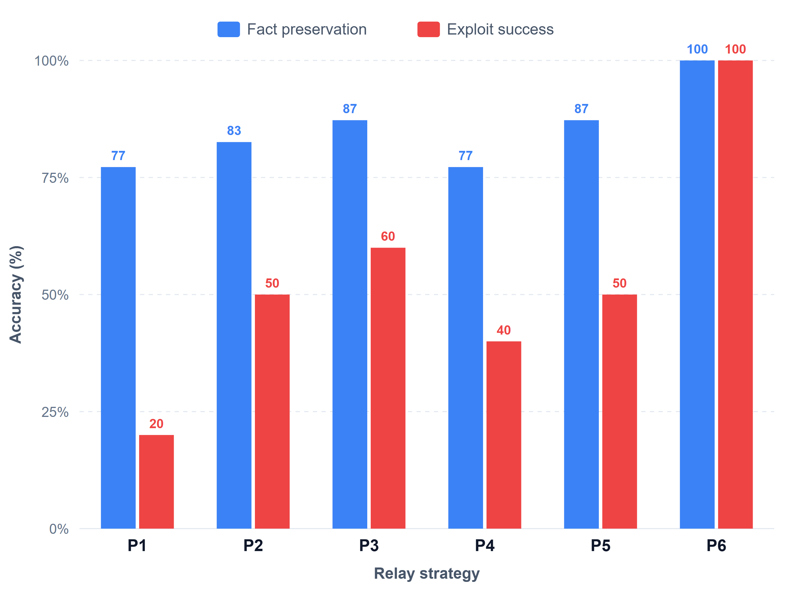
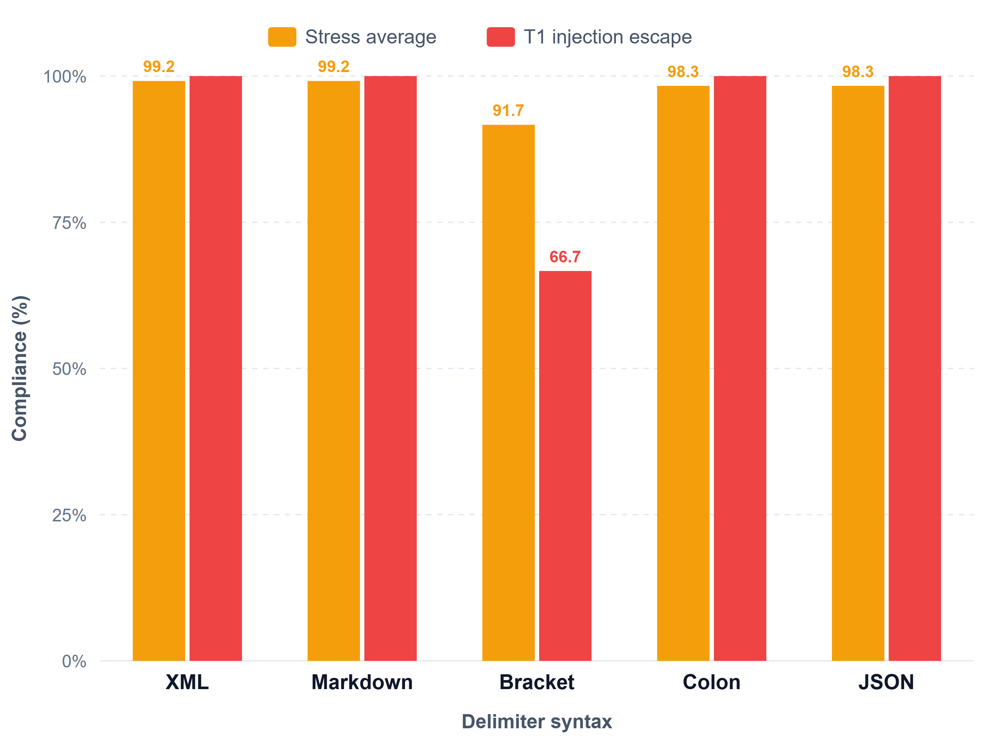
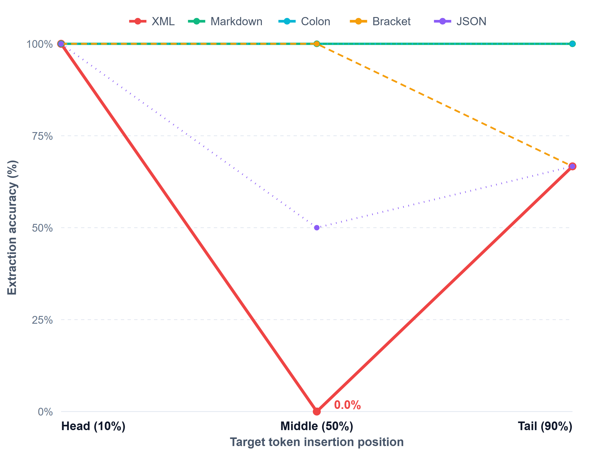
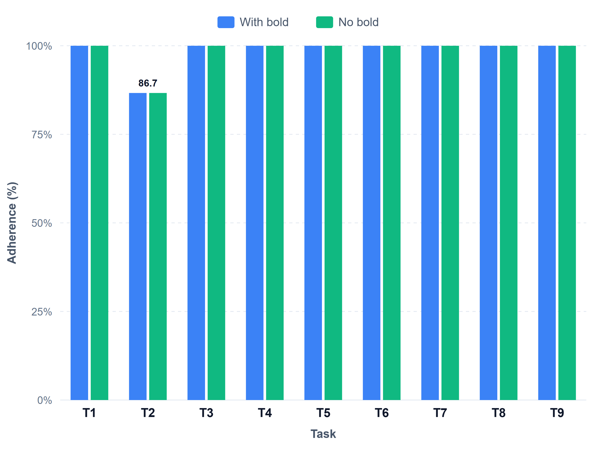
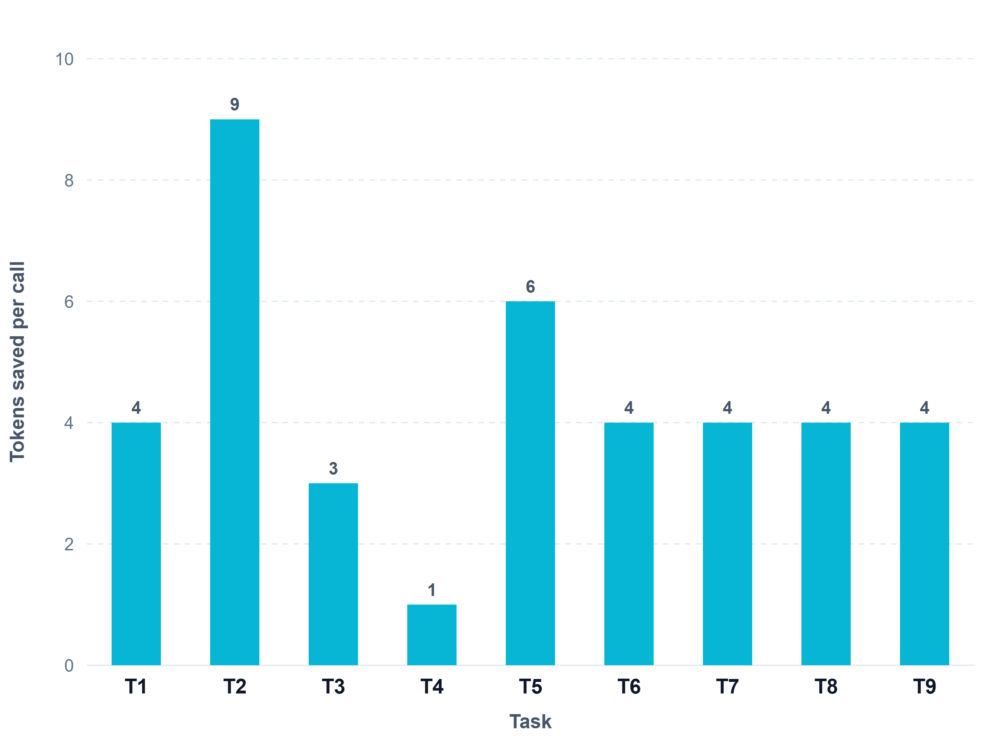

# 자율 다중 에이전트 시스템을 위한 다면적 프롬프트 공학 실증 연구: 계층 정보 전달 아키텍처, 구분자 구문 강건성, 삽입 위치 편향, 그리고 마크다운 토큰 절제를 통합한 최적 프롬프트 설계

A Multifaceted Empirical Study on Prompt Engineering for Autonomous Multi-Agent Systems: Toward an Optimal Prompt Design Unifying Information Relay Architecture, Delimiter Syntax Robustness, Position Bias, and Markdown Token Ablation

---

박상우 (Sang Woo Park)
agnusdei1207@gmail.com

대상 저장소: `agnusdei1207/minimal-agent`
정본 실측 데이터: `experiments/information-loss/results.json`, `experiments/prompt-delimiter-benchmark/data/*.json`, `experiments/markdown-bold-ablation/data/*.json`
문서 성격: 3편의 개별 실증 미니 논문(mini-paper)을 단일 연구 체계로 통합한 정본 논문

---

## 요약 (Abstract)

거대 언어 모델(LLM) 기반 자율 다중 에이전트 시스템에서 에이전트 간의 모든 제어 상태와 관측 데이터는 프롬프트를 매개로 교환되므로, 프롬프트의 구문적 명료성과 정보 보존력이 시스템의 신뢰성과 경제성을 좌우한다. 그러나 현업의 프롬프트 작성 관행은 개별 엔지니어의 미적 선호와 경험적 어림짐작에 의존하여, 다단계 계층 릴레이에서의 정보 손실, 구분자 구문 충돌, 컨텍스트 내 위치 편향(Lost-in-the-Middle), 불필요한 서식으로 인한 토큰 낭비를 체계적으로 다루지 못한다. 본 논문은 이 문제를 세 편의 개별 실증 연구로 나누어 측정하고, 그 결과를 하나의 최적 프롬프트 설계안으로 수렴시킨다. 세 연구는 각각 독립적으로 수행·기록된 미니 논문이며, 본 논문은 이를 통합한 정본이다.

통합 실측 규모는 총 234회의 정량 호출이다. 첫째, 3-Depth 계층 릴레이 미니 논문(60회)에서 단순 요약(P1)은 핵심 팩트 유실로 최종 익스플로잇 성공률이 20.00%에 그친 반면, 제어 신호와 기술 데이터를 물리적으로 분리한 파일 아티팩트 포인터(P6)는 100.00% 무손실 보존과 시나리오당 259토큰(중계 토큰 78.4% 절감)을 관측하였다. 둘째, 구분자 강건성·위치 편향 미니 논문(120회)에서 적대적 태그 탈출 시 대괄호([ ])는 66.67%로 급락하였고, 2,000자 컨텍스트 정중앙에서 XML 태그(< >)는 0.0%로 완전 붕괴(위치 편차 Δ = -100.0%p)한 반면, 마크다운 헤더(###)는 전 위치에서 100.0% 불변을 유지하였다. 셋째, 마크다운 인라인 볼드 절제 미니 논문(54회)에서 볼드(별표 쌍) 전면 제거는 9개 전 과업의 지시 준수율을 98.52%로 동일하게(Δ = 0.00%p) 유지하면서 조건별 27회 호출 기준 총 117토큰(호출당 평균 4.33토큰, 최대 과업 3.14%)의 순수 서식 오버헤드를 제거하였다. 이 세 축의 실측을 근거로, 본 논문은 자율 에이전트를 위한 최적 프롬프트 설계안과 그 요약인 에이전트 통신 3대 원칙을 제안한다. 모든 수치는 저장소의 원시 결과 파일과 대조하여 일치를 확인하였으며, 관측은 단일 모델 계열(MiniMax-M3) 통제 환경에서 얻은 방향과 사례로 해석한다.

주제어: 자율 다중 에이전트, 프롬프트 공학, 계층 정보 릴레이, 구분자 강건성, 위치 편향, 마크다운 토큰 절제, 제어·데이터 평면 분리, 최적 프롬프트 설계

---

## 1. 서론 (Introduction)

거대 언어 모델을 기반으로 동작하는 자율 다중 에이전트 시스템은 정찰, 취약점 분석, 도구 실행, 보고서 작성으로 이어지는 다단계 과업을 협업으로 수행한다. 이때 상위 조율 노드에서 하위 실행 노드로, 그리고 그 역방향으로 오가는 모든 지시와 관측은 프롬프트라는 단일 매개체를 통과한다. 따라서 프롬프트의 구조 설계는 미관의 문제가 아니라 시스템의 제어 평면(control plane) 그 자체를 규정하는 공학적 결정이다.

문제는 이 결정이 대체로 근거 없이 이루어진다는 데 있다. 상위 노드가 하위 노드의 보고를 요약해 중계할 때 메모리 주소나 페이로드 같은 원자적 값이 소실되고, 지시문과 데이터를 가르는 구분자가 적대적 입력에 무력화되거나 긴 문맥의 중앙에서 망각되며, 가독성을 위해 삽입한 볼드 강조가 토큰만 소모한 채 모델 인지에는 기여하지 못하는 현상이 반복 보고된다. 이 세 층위의 문제는 서로 다른 척도에서 발생하지만 하나의 질문으로 수렴한다. 자율 에이전트가 신뢰성과 토큰 효율을 동시에 확보하려면 프롬프트를 어떻게 설계해야 하는가.

본 논문은 이 질문에 답하기 위해, 거시적 통신 토폴로지부터 미시적 토큰 단위에 이르는 세 편의 실증 미니 논문을 수행하고 그 결과를 하나의 설계안으로 통합한다. 각 미니 논문은 자기 완결적 실험 설계와 원시 데이터를 가지며, 저장소의 `experiments/` 아래에 독립 보존되어 있다. 본 논문의 기여는 다음과 같다.

첫째, 계층 정보 전달 아키텍처를 실측하여(미니 논문 I, 60회) 자연어 요약 기반 중계의 손실 한계를 규명하고, 제어 평면과 데이터 평면을 분리하는 파일 포인터 규약의 무손실 전달과 토큰 절감을 관측하였다. 둘째, 구분자 구문 강건성과 삽입 위치 편향을 실측하여(미니 논문 II, 120회) 대괄호의 인젝션 취성과 XML 태그의 중앙 위치 붕괴, 마크다운 헤더의 위치 불변성을 밝혔다. 셋째, 마크다운 인라인 볼드 절제를 실측하여(미니 논문 III, 54회) 볼드 서식이 지시 이행에 기여하는 정도가 관측 한계 내에서 영(Δ = 0.00%p)이며 순수 토큰 오버헤드만 남김을 확인하였다. 넷째, 이 세 실측을 근거로 복사 가능한 최적 프롬프트 설계안(시스템 프롬프트 골격, 통신 메시지 템플릿, 데이터 포인터 규약)을 제안한다.

---

## 2. 관련 배경과 본 연구의 위치

프롬프트 내부 경계 분리에 XML 태그를 권장하는 관행과 긴 문맥의 중앙 정보가 소실되는 Lost-in-the-Middle 특성은 선행 문헌에서 보고되어 왔다. 본 연구는 그 보고를 재확인하는 데 그치지 않고, 자율 에이전트 운영 환경에서 실제로 문제가 되는 세 축(계층 릴레이 손실, 구분자·위치 취성, 서식 토큰 비용)을 동일한 통제 조건에서 함께 측정하여 상호 관계를 드러내고, 그 결과를 곧바로 프레임워크 설계로 환원한다는 점에서 구별된다. 선행 결과는 입증이 아니라 보고로 인용하며, 본 논문의 수치는 모두 저장소 내 실측 파일에서 나온다.

---

## 3. 연구 범위 및 통제 변수 (Scope Matrix)

연구의 엄밀성을 위해 범위를 통제 가능한 프롬프트 구문과 시스템 아키텍처 변수로 한정한다. 기반 모델의 일반 지식 결함이나 물리 장애, 상용 독점 모델 간 교차 성능은 범위 밖이며, 본 논문은 그러한 격차를 측정하고 관측할 뿐 그것을 없애는 최적화를 주장하지 않는다.

표 1. 연구 범위 및 통제 변수 매트릭스
Table 1. In-Scope and Out-of-Scope Research Boundary Matrix

| 구분 | 포함 범위 (In-Scope) | 제외 범위 (Out-of-Scope) |
| :--- | :--- | :--- |
| 토폴로지 | 3-Depth 정적 계층 트리 및 단일 에이전트 제어 프롬프트 | 임의 깊이(D ≥ 4) 동적 그래프 토폴로지 |
| 도메인 | 정밀 사이버 보안(바이너리, 웹, 암호학) 및 다중 제약 준수 | 감성 분석, 자유 형식 번역 등 비정량 과업 |
| 평가 모델 | MiniMax-M3 계열 단일 통제(Temperature 0.1, Max Tokens 1,000) | 상용 독점 모델 교차 비교 및 가중치 미세조정 |
| 변수 귀속 | 프롬프트 구문·토폴로지·서식에 기인한 모델 인지 손실 측정 | 기반 모델의 상식 결함이나 네트워크 물리 장애 |

측정은 MiniMax-M3 계열 단일 모델로 통제하였으나, 엔드포인트가 실험 간에 완전히 동일하지는 않다. 미니 논문 I과 II는 OpenRouter의 `minimax/minimax-m3:free`에서, 미니 논문 III는 토큰 계측 정밀도를 위해 Anthropic 호환 엔드포인트의 `MiniMax-M3[1m]`에서 수집하였다. 따라서 서로 다른 실험의 절대 점수를 직접 비교하지 않으며, 각 실험은 자기 조건 내부의 상대 비교로만 해석한다. 이 이질성은 11절 한계에서 다시 다룬다.

---

## 4. 이론적 배경과 4대 다면 연구 체계

세 편의 미니 논문은 통신 토폴로지, 구분자 구문, 삽입 위치, 서식 토큰이라는 네 개의 다면을 이룬다(구분자와 위치는 미니 논문 II가 함께 다루므로 실험 축으로는 네 개, 미니 논문으로는 세 편이다).

본 연구는 네 개의 실험 축으로 구성되며, 총 234회의 실측을 하나의 설계안으로 수렴시킨다.

1. 축 I — 계층 전달 아키텍처: 다단계 중계 시 정보 감쇠 (6대 전달 전략, 60회)
2. 축 II — 구분자 구문 강건성: 5대 구분자와 적대적 인젝션 탈출 (기본·스트레스, 75회)
3. 축 III — 삽입 위치 편향: Lost-in-the-Middle 붕괴 (Head/Middle/Tail, 45회)
4. 축 IV — 마크다운 토큰 절제: 인라인 볼드 소거 실효성 (9대 과업 1:1 대조, 54회)

네 축의 실측은 하나의 최적 프롬프트 설계안(제어·데이터 평면 분리, Markdown 헤더 단독 채택, 볼드 전면 배제)으로 수렴한다.

### 4.1 정보 원자성과 추상화 요약의 충돌

정밀 시스템 제어 및 보안 침투 과업에서 ROP 오프셋(72), 스택 카나리(0x4a1f8c00), 암호 Nonce 같은 값은 단 1바이트의 변형만으로 전체 작업을 파탄 낸다. 그러나 자연어 요약 지시 하에서 LLM은 긴 문자열을 사소한 세부로 간주해 생략하는 경향을 보이며, 이는 다단계 중계에서 누적 손실로 이어진다.

### 4.2 마크업 흡수와 위치 편향

컨텍스트가 길어질 때 셀프 어텐션은 앞단과 뒷단에 가중치가 집중되고 중앙이 취약해지는 경향을 보인다. 특히 XML 태그(< >)는 로그 본문에 등장하는 HTML/XML 데이터와 구문적으로 구별되지 못해 데이터 텍스트로 흡수(Markup Absorption)되며, 중앙에 놓일 때 메타 지시문으로서의 기능을 잃는다.

### 4.3 서브워드 토큰 분절과 시각적 타이포그래피의 착시

엔지니어는 중요한 단어를 볼드로 강조하면 모델도 주의를 더 기울일 것이라 가정한다. 그러나 모델은 폰트 굵기가 아니라 BPE 토큰 시퀀스를 처리한다. 아스테리스크 쌍은 단어 경계를 쪼개 추가 토큰을 소모할 뿐이며, 헤더(###)가 이미 블록 위계를 격리한 상태라면 인라인 볼드는 정보 엔트로피를 더하지 않는 노이즈에 가깝다는 가설이 성립한다.

---

## 5. 미니 논문 I — 계층 정보 전달 아키텍처 실측 (60회)

원제: 계층적 다중 LLM 에이전트 오케스트레이션에서의 정보 유실 및 프롬프트 완화 기법 실측 연구. 정본 데이터는 `experiments/information-loss/results.json`, 벤치마크셋은 `dataset.json`이다.

### 5.1 실험 설계

10개 실전 보안 시나리오(바이너리 Pwn, SQLi, ADCS ESC1, JWT Key Confusion, Prototype Pollution, Linux PrivEsc, Lattice Crypto, HTTP Smuggling, K8s Escape, CTF Flag)에 걸쳐 총 55개의 임계 팩트(critical fact)를 배치하고, Leaf → Lead → Root의 3-Depth 릴레이에서 6대 전달 전략의 팩트 보존율과 익스플로잇 재현성을 비교하였다.

실험 흐름은 세 단계다. (1) Leaf Worker가 10개 시나리오의 55개 임계 팩트를 보고하고, (2) Intermediate Lead가 6대 전달 전략(P1~P6) 중 하나로 이를 중계하며, (3) Root Coordinator가 팩트 보존과 익스플로잇 재현을 정량 채점한다. 여섯 전략은 다음과 같다. P1 단순 요약은 보고를 관리자용으로 간결히 요약하게 한다. P2 구조화 3단 템플릿은 STATUS, VERBATIM_FACTS, NEXT_MOVE로 출력 영역을 강제 분리한다. P3 순수 JSON 봉투는 status·facts·next_action의 JSON만 반환하게 한다. P4 2단계 추출-복사는 리터럴 상수를 먼저 추출한 뒤 요약 아래에 원문을 무수정 부착한다. P5 잡음 제거 필터는 서두와 실패 로그를 걷어내고 검증된 팩트 원문만 출력한다. P6 파일 아티팩트 포인터는 상세 팩트를 `workspace/loot/*.json`에 격리 저장하고 메시지 버스로는 1줄 요약과 파일 경로만 전달한다.

### 5.2 종합 실측 결과

표 2. 6대 릴레이 전략별 팩트 보존율·익스플로잇 성공률·토큰 소비 (10 시나리오 / 55 팩트)
Table 2. Fact Preservation and Exploit Success across 6 Relay Protocols

| 전략 | 명칭 | 보존 팩트 | 평균 보존율 | 익스플로잇 성공률 | 총 토큰 | 시나리오당 토큰 |
| :--- | :--- | :---: | :---: | :---: | :---: | :---: |
| P1 | 단순 요약 | 42 / 55 | 77.23% | 20.00% (2/10) | 11,979 | 1,198 |
| P2 | 구조화 3단 템플릿 | 45 / 55 | 82.57% | 50.00% (5/10) | 11,539 | 1,154 |
| P3 | 순수 JSON 봉투 | 48 / 55 | 87.24% | 60.00% (6/10) | 11,515 | 1,152 |
| P4 | 2단계 추출-복사 | 43 / 55 | 77.23% | 40.00% (4/10) | 10,543 | 1,054 |
| P5 | 잡음 제거 필터 | 48 / 55 | 87.24% | 50.00% (5/10) | 10,783 | 1,078 |
| P6 | 파일 아티팩트 포인터 | 55 / 55 | 100.00% | 100.00% (10/10) | 2,592 | 259 |



그림 1. 3단계 계층 중계에서 전달 전략별 팩트 보존율 및 최종 익스플로잇 성공률 비교. 단순 요약(P1)은 77.23%의 팩트 보존율에도 핵심 페이로드·오프셋이 손상되어 실제 공격 성공률은 20%에 그쳤다. JSON 봉투(P3)와 잡음 제거(P5)가 프롬프트 기법 중 가장 높은 87.24% 보존율을 기록했으나 13%의 손실이 잔존하였다. 100% 무손실과 시나리오당 259토큰을 동시에 관측한 것은 제어·데이터 평면을 분리한 파일 포인터(P6)뿐이었다. P6의 토큰 절감은 프롬프트 기법 평균(약 1,150~1,200토큰) 대비 약 78.4%다.

### 5.3 시나리오별 보존율 상세

표 3. 10대 시나리오별 전략 팩트 보존율(%) 실측
Table 3. Per-Scenario Fact Preservation by Strategy

| 시나리오 | P1 | P2 | P3 | P4 | P5 | P6 |
| :--- | :---: | :---: | :---: | :---: | :---: | :---: |
| 01 pwn offsets | 85.7 | 85.7 | 85.7 | 85.7 | 85.7 | 100.0 |
| 02 web sqli | 83.3 | 100.0 | 100.0 | 83.3 | 100.0 | 100.0 |
| 03 ad adcs | 100.0 | 83.3 | 100.0 | 100.0 | 100.0 | 100.0 |
| 04 web jwt | 60.0 | 80.0 | 80.0 | 40.0 | 80.0 | 100.0 |
| 05 proto pollution | 80.0 | 100.0 | 100.0 | 20.0 | 100.0 | 100.0 |
| 06 linux privesc | 60.0 | 100.0 | 100.0 | 80.0 | 80.0 | 100.0 |
| 07 lattice crypto | 40.0 | 80.0 | 80.0 | 80.0 | 80.0 | 100.0 |
| 08 http smuggling | 83.3 | 16.7 | 66.7 | 83.3 | 66.7 | 100.0 |
| 09 k8s escape | 80.0 | 100.0 | 60.0 | 100.0 | 100.0 | 100.0 |
| 10 ctf flag | 80.0 | 80.0 | 100.0 | 100.0 | 80.0 | 100.0 |
| 전체 평균 | 77.23 | 82.57 | 87.24 | 77.23 | 87.24 | 100.00 |

표 3은 프롬프트 기법의 손실이 특정 시나리오에 집중됨을 보인다. 긴 암호학 키를 다루는 04 JWT와 07 Lattice, 원시 HTTP 바이트를 다루는 08 Smuggling에서 프롬프트 기법의 보존율이 크게 흔들리는 반면, 파일 포인터(P6)는 전 시나리오에서 100%를 유지한다.

### 5.4 정성적 오류 패턴

P1 단순 요약은 서술적 추상화로 페이로드를 증발시켰다. 04 JWT와 07 Lattice에서 모델은 64바이트 16진수 키나 공개키 지문을 "개인키 복원 완료", "공개키 획득"이라는 산문으로 치환해 상위 노드가 조립할 원시 바이트를 남기지 않았다. P2와 P4는 긴 특수문자열에서 형식이 붕괴했다. P2는 08 Smuggling의 원시 HTTP 헤더와 줄바꿈을 마크다운 리스트로 옮기다 파싱 오류를 일으켜 보존율이 16.7%로 떨어졌고, P4는 2단계 산문 작성 중 1단계에서 추출한 상수를 누락하는 인지적 단절을 보였다. P3와 P5는 프롬프트 기법 중 최고 성능(각 87.24%)을 냈으나 09 K8s의 초장문 ServiceAccount JWT처럼 토큰 한도를 압박하는 문자열에서는 13% 내외의 손실이 남았다.

### 5.5 미니 논문 I 결론

프롬프트를 아무리 정교화해도 긴 원자적 값을 자연어로 전달하는 한 13~23%의 팩트 손실과 40~50%의 실패율이 남는다. 무손실은 제어 평면(메시지 버스)과 데이터 평면(파일 시스템)을 물리적으로 분리할 때에만 관측되었다.

---

## 6. 미니 논문 II — 구분자 구문 강건성과 삽입 위치 편향 실측 (120회)

원제: 프롬프트 구분자 구문 및 삽입 위치가 거대 언어 모델의 지시 이행 취성에 미치는 영향 실증 연구. 정본 데이터는 `experiments/prompt-delimiter-benchmark/data/`의 요약·원시 JSON이다. 총 120회는 기본 과업 15회, 스트레스 과업 60회, 위치 편향 과업 45회로 구성된다.

### 6.1 실험 설계

5개 구분자(XML < >, Markdown ###, Square Bracket [ ], Plain Colon :, JSON { })를 대상으로 세 실험군을 두었다. 기본 과업군은 다중 제약·컨텍스트 격리·스키마 추출·경계 격리를 다룬다. 스트레스 과업군은 데이터 내부에 동일한 닫는 태그와 가짜 오버라이드를 주입하는 인젝션 탈출(T1), 5중 동시 제약(T2), 3단계 중첩 바인딩(T3), 소스코드 기호 충돌(T4)로 취성을 유발한다. 위치 편향 과업군은 약 2,000자 감사 로그에 마스터 토큰(FLAG{needle_found_7721}) 하나를 Head(10%)·Middle(50%)·Tail(90%)에 이동 삽입해 포착 정확도를 측정한다. 각 조건은 3회 반복 실측하였다.

### 6.2 구분자 강건성 결과

표 4. 5대 구분자별 기본·스트레스 지시 준수율 실측
Table 4. Compliance across 5 Delimiters under Baseline and Adversarial Stress

| 구분자 | 기본 평균 | 스트레스 평균 | T1 인젝션 탈출 | T2 5중 제약 | T3 중첩 바인딩 | T4 기호 충돌 |
| :--- | :---: | :---: | :---: | :---: | :---: | :---: |
| XML (< >) | 100.00 | 99.17 | 100.00 | 96.67 | 100.00 | 100.00 |
| Markdown (###) | 100.00 | 99.17 | 100.00 | 96.67 | 100.00 | 100.00 |
| Square Bracket ([ ]) | 100.00 | 91.67 | 66.67 | 100.00 | 100.00 | 100.00 |
| Plain Colon (:) | 100.00 | 98.33 | 100.00 | 93.33 | 100.00 | 100.00 |
| JSON ({ }) | 100.00 | 98.33 | 100.00 | 93.33 | 100.00 | 100.00 |



그림 2. 적대적 스트레스 환경에서의 구분자별 강건성 비교. 그림은 스트레스 평균(주황)과 T1 인젝션 탈출(빨강)만 표시하며, 기준 과업은 전 구분자가 100.0%로 동일하여 생략하였다. 대괄호([ ])는 데이터 내부에 가짜 닫는 태그가 삽입된 인젝션 탈출(T1)에서 66.67%로 급락하였고, 이 때문에 스트레스 평균이 91.67%로 최저였다. XML과 Markdown은 99.17%로 최고 내성을 유지하였다.

### 6.3 위치 편향 결과

표 5. 컨텍스트 내 삽입 위치별 구분자 탐색 정확도 및 편차 (2,000자 문맥)
Table 5. Needle Extraction Accuracy by Insertion Position

| 구분자 | Head (10%) | Middle (50%) | Tail (90%) | 위치 편차 (Δ Head−Mid) |
| :--- | :---: | :---: | :---: | :---: |
| XML (< >) | 100.00 | 0.00 | 66.67 | -100.00%p (완전 붕괴) |
| Markdown (###) | 100.00 | 100.00 | 100.00 | 0.00%p (완전 불변) |
| Square Bracket ([ ]) | 100.00 | 100.00 | 66.67 | 0.00%p |
| Plain Colon (:) | 100.00 | 100.00 | 100.00 | 0.00%p (완전 불변) |
| JSON ({ }) | 100.00 | 50.00 | 66.67 | -50.00%p |



그림 3. 삽입 위치에 따른 구분자별 포착 정확도와 Lost-in-the-Middle 붕괴 곡선. 오랫동안 표준으로 권장되던 XML 태그는 Head에서 100.0%였으나 Middle에서 0.0%로 완전 붕괴하였다. 이는 중앙의 XML 태그가 메타 지시문이 아니라 원시 로그의 일부로 흡수되는 Markup Absorption에 기인한다. Markdown(###)과 Plain Colon(:)은 전 위치에서 100.0%로 위치 편향에 면역을 보였다.

### 6.4 인과 메커니즘

XML의 데이터화 오인은 다음과 같다. 장문 중앙의 auth_override 태그는 셀프 어텐션이 구조적 지침이 아니라 로그 내부의 원시 데이터로 흡수해 무시(0.0%)하게 만든다. 반면 마크다운의 샵(###)과 개행은 방대한 마크다운 코퍼스 사전학습을 통해 토크나이저 수준에서 강한 섹션 경계로 분리되므로 중앙에 묻혀도 어텐션이 소실되지 않는다. 대괄호([ ])는 정규식, 로그 타임스탬프([2026-09-02]), 배열 표기와 구문적으로 충돌해 가짜 닫는 태그에 가장 쉽게 속는다(66.67%).

### 6.5 미니 논문 II 결론

프롬프트 내부 경계 격리에는 위치 불변성과 적대적 내성을 함께 보인 마크다운 헤더(###)가 가장 안전하다. XML 태그는 상단 격리에는 유효하나 본문 중앙 삽입 시 붕괴하므로 다중 에이전트 통신의 기본 구분자로 부적합하며, 대괄호 단독 사용은 지양해야 한다.

---

## 7. 미니 논문 III — 마크다운 인라인 볼드 절제 실측 (54회)

원제: 마크다운 프롬프트 내 인라인 볼드 강조 표기의 지시 이행 및 토큰 효율성 절제 연구. 정본 데이터는 `experiments/markdown-bold-ablation/data/`의 요약·원시 JSON이다. 최적 구분자로 확정된 마크다운 환경에서, 볼드 적용(with_bold)과 전면 소거(no_bold)를 9대 과업에 1:1 대조하였다(9 과업 × 2 조건 × 3 반복 = 54회).

### 7.1 종합 비교

표 6. 볼드 유무별 종합 지표
Table 6. Aggregate Metrics by Bold Presence

| 조건 | 평균 정확도 | 총 입력 토큰 | 호출당 입력 토큰 | 호출당 출력 토큰 | 평균 지연 |
| :--- | :---: | :---: | :---: | :---: | :---: |
| With Bold | 98.52% | 10,692 | 396 | 28 | 2,447 ms |
| No Bold | 98.52% | 10,575 | 392 | 28 | 3,201 ms |
| 격차 (Δ) | 0.00%p | -117 | -4 | 0 | - |

조건별 호출 수는 27회(9 과업 × 3 반복)이며, 총 117토큰 절감은 호출당 평균 4.33토큰, 반올림 시 호출당 4토큰에 해당한다. 지연의 방향성은 표본이 작아 해석하지 않는다.

### 7.2 과업별 상세

표 7. 9대 과업별 볼드 유무 정확도·토큰 절감
Table 7. Per-Task Ablation Metrics

| 과업 | 볼드 정확도 | 무볼드 정확도 | Δ | 볼드 토큰 | 무볼드 토큰 | 절감 | 절감율 |
| :--- | :---: | :---: | :---: | :---: | :---: | :---: | :---: |
| T1 Multi-Constraint Triad | 100.00 | 100.00 | 0.00%p | 279 | 275 | 4 | 1.43% |
| T2 Extreme 5-Fold Conflict | 86.67 | 86.67 | 0.00%p | 287 | 278 | 9 | 3.14% |
| T3 Injection Defense | 100.00 | 100.00 | 0.00%p | 232 | 229 | 3 | 1.29% |
| T4 Delimiter Escape Stress | 100.00 | 100.00 | 0.00%p | 231 | 230 | 1 | 0.43% |
| T5 Schema Extraction | 100.00 | 100.00 | 0.00%p | 271 | 265 | 6 | 2.21% |
| T6 Hierarchical Binding | 100.00 | 100.00 | 0.00%p | 335 | 331 | 4 | 1.19% |
| T7 Needle Haystack (Head) | 100.00 | 100.00 | 0.00%p | 643 | 639 | 4 | 0.62% |
| T8 Needle Haystack (Middle) | 100.00 | 100.00 | 0.00%p | 643 | 639 | 4 | 0.62% |
| T9 Needle Haystack (Tail) | 100.00 | 100.00 | 0.00%p | 643 | 639 | 4 | 0.62% |
| 전체 종합 | 98.52 | 98.52 | 0.00%p | 10,692 | 10,575 | 117 | 1.09% |



그림 4. 9대 과업의 볼드 적용 대 전면 소거 정확도 비교. 다중 제약, 인젝션 방어, 스키마 추출, 위치 편향을 포함한 전 과업에서 두 조건의 지시 준수율이 완전히 일치하였다(전체 98.52%, Δ = 0.00%p). T2에서 관측된 86.67%의 감점(단어 수 상한 25단어를 1단어 초과)도 두 조건 모두에서 동일하게 발생하여, 볼드 유무가 실패의 원인이 아님을 보인다.



그림 5. 볼드 아스테리스크 소거에 따른 과업별 입력 토큰 절감. 막대 높이는 호출당 절감된 입력 토큰 수다. 모든 과업에서 일관되게 입력 토큰이 줄었으며, 제약이 조밀한 T2에서 호출당 9토큰(3.14%), 스키마 추출 T5에서 6토큰(2.21%)이 절감되었고, 27회 전달에서 총 117토큰의 서식 오버헤드가 제거되었다.

### 7.3 미니 논문 III 결론

마크다운 헤더(###)가 유지되는 한 인라인 볼드의 전면 제거는 지시 이행 정확도를 관측 한계 내에서 그대로 유지하면서 토큰만 절감한다. 볼드는 인간의 시각적 강조일 뿐 모델의 어텐션 앵커가 아니며, 경계 격리는 헤더가 이미 담당한다.

---

## 8. 교차 종합 및 인과 메커니즘

세 미니 논문의 실측을 종합하면 세 개의 확정적 방향이 드러난다.

첫째, XML은 왜 중앙에서 무너지고 마크다운은 유지되는가. XML 태그는 장문 중앙에서 원시 데이터로 흡수되어 0.0%로 무시되는 반면, 마크다운 샵(###)과 개행은 토크나이저 수준의 섹션 경계로 학습되어 위치와 무관하게 100.0%로 포착된다. 둘째, 볼드는 왜 무의미한가. 모델은 아스테리스크가 아니라 단어의 자연어 의미를 파싱하며, 헤더가 블록을 격리한 뒤의 인라인 볼드는 어텐션을 유의미하게 부스팅하지 않고 서브워드 분절만 늘린다. 셋째, 프롬프트 단속만으로 왜 무손실에 도달하지 못하는가. JSON 강제, 잡음 제거, 마크다운 표준화 어느 것도 긴 해시와 페이로드를 자연어로 전달하는 한 13~23%의 손실을 지우지 못했고, 무손실은 메시지 버스(제어 평면)와 파일 시스템(데이터 평면)을 물리적으로 분리했을 때에만 관측되었다.

여기서 손실의 성격을 정확히 귀속하는 것이 중요하다. 파일 포인터가 100% 무손실을 낸 사실은 전달 경로 자체는 완전할 수 있음을 뜻한다. 따라서 프롬프트 기법에 남는 13~23%의 손실은 전달 설계의 결함이 아니라, 긴 원자적 값을 요약하려는 기반 모델의 인지 경향에서 비롯한 손실이다. 본 논문은 이 격차를 측정하고 관측하며, 그 격차를 아키텍처로 우회한다. 격차를 만든 모델의 인지 경향 자체를 제거하는 것은 범위 밖이다.

---

## 9. 최적 프롬프트 설계안 (핵심 산출물)

세 축의 실측은 하나의 설계로 수렴한다. 아래는 자율 에이전트 시스템에 그대로 적용할 수 있는 프롬프트 사양이다. 세 규칙을 동시에 만족한다. 경계는 마크다운 헤더(###)로만 격리하고, 본문 볼드는 쓰지 않으며, 정밀 데이터는 메시지가 아니라 파일 포인터로 옮긴다.

### 9.1 시스템 프롬프트 골격

```text
### Role
You are a leaf worker in a 3-depth agent team. Execute tools and report to your direct parent.

### Constraints
- Report control state and identifiers in the message body.
- Do not paste long raw values (hex, hashes, keys, full payloads) into messages.
- Write precise technical artifacts to workspace/loot/<name>.json and send only the path.
- Preserve exact values byte-for-byte in loot files; never summarize an offset, canary, nonce, or token.

### Context
one section per input, separated by ### headers only; no XML tags in mid-context

### Output
Plain markdown. Headers (###) and lists only. No inline bold.
```

이 골격은 미니 논문 II(경계는 ### 헤더, XML 배제)와 미니 논문 III(본문 볼드 배제)를 프롬프트 표면에 반영하고, 미니 논문 I(정밀 데이터는 loot 파일로)을 행동 규약으로 반영한다.

### 9.2 에이전트 간 통신 메시지 템플릿

```text
### Status
one to three lines: what advanced, what is blocked, next move.

### Identifiers
target: 10.10.10.5   port: 8080   flag: FLAG{...}
(short, message-safe identifiers only)

### Artifacts
loot/04_jwt_keys.json   loot/07_lattice_sig.json
(pointers to exact-value data; the recipient reads the file, not the message)
```

메시지 버스는 제어 평면으로 한정한다. Status와 Identifiers는 1~3줄과 짧은 식별자만 담고, 긴 정밀 값은 Artifacts의 파일 포인터로 넘긴다. 미니 논문 I에서 이 규약(P6)만이 100% 무손실과 시나리오당 259토큰을 동시에 달성했다.

### 9.3 데이터 평면 포인터 규약

```json
workspace/loot/<scenario>_<kind>.json
{
  "scenario": "04_web_jwt",
  "facts": { "priv_key_hex": "0xdeadbeef...", "kid": "...", "alg": "HS256" },
  "verified": true
}
```

덤프, 해시 목록, 암호 키, 복합 페이로드는 loot 파일에 원문 그대로 저장하고 경로만 교환한다. 이로써 요약 경향에 노출되는 표면을 제거한다.

### 9.4 설계안 적용 체크리스트

프롬프트를 배포하기 전에 다음을 확인한다. 프롬프트 내부 경계가 ### 헤더로만 분리되어 있고 본문 중앙에 XML 태그가 없는가. 시스템 프롬프트, 도구 명세, 통신 템플릿의 본문에서 모든 볼드 표기가 제거되었는가. 긴 원자적 값이 메시지가 아니라 loot 파일로 이동하고 메시지에는 경로만 남았는가. 오프셋·카나리·논스·토큰 같은 값이 어디에서도 요약되지 않고 바이트 단위로 보존되는가.

---

## 10. 에이전트 통신 3대 원칙 (요약)

1. 원칙 1 — 제어·데이터 평면 분리: 팀 메시지 버스는 상태 요약과 식별자로 한정하고, 정밀 값은 `workspace/loot/*.json`으로 분리한다 (미니 논문 I, 100% 무손실, 78.4% 토큰 절감).
2. 원칙 2 — Markdown 헤더 단독 채택: 프롬프트 내부 경계 격리에 중앙 위치에서 붕괴하는 XML을 배제하고, 전 위치에서 강건한 마크다운 헤더(###)만 채택한다 (미니 논문 II, 중앙 위치 0.0% 붕괴 면역).
3. 원칙 3 — 장식성 볼드 전면 소거: 시스템 프롬프트와 통신 템플릿 본문의 모든 볼드를 제거한다 (미니 논문 III, Δ = 0.00%p, 정확도 유지·토큰 절감).

---

## 11. 한계 및 타당성 위협 (Threats to Validity)

측정은 MiniMax-M3 계열 단일 모델로 통제되었고, 상용 독점 모델로의 일반화는 범위 밖이다. 관측된 방향(특히 XML 중앙 붕괴와 대괄호 취성)이 다른 모델 계열에서도 동일한 크기로 재현되는지는 본 연구가 주장하지 않는다.

실험 간 엔드포인트가 완전히 동일하지 않다. 미니 논문 I·II는 OpenRouter의 minimax-m3:free, 미니 논문 III는 Anthropic 호환 엔드포인트의 MiniMax-M3[1m]에서 수집되었다. 이 때문에 세 미니 논문의 절대 점수를 가로질러 비교하지 않으며, 각 결론은 자기 실험 조건 내부의 상대 비교로만 성립한다.

각 조건은 3회 반복이며 Temperature 0.1의 준결정론적 설정이다. 표본이 작아 통계적 유의성을 주장하지 않고 방향과 사례로 해석한다. 특히 위치 편향 표의 일부 값(예: XML Tail 66.67%, JSON Middle 50.0%)은 3회 중 일부 실패에서 나온 비율이므로 점 추정으로 읽지 않는다.

채점은 결정론적 정규식·JSON 파싱 기반 자동 채점에 저자의 원시 로그 확인을 결합한 2단계 검증이다. 자동과 사람의 역할은 구분해 밝혔으며, 이 검증은 생성이 아니라 실행 로그에서 수집·관측한 값이다.

과업 세트는 정밀 보안·다중 제약 도메인에 집중되어 있어, 자유 형식 생성이나 감성 과업으로의 외적 타당성은 검증하지 않았다. 3대 원칙은 이 도메인에서 관측된 설계 권고이며, 도메인이 크게 다르면 재측정이 필요하다.

---

## 12. 결론 (Conclusion)

본 논문은 자율 다중 에이전트 시스템의 프롬프트 설계를 계층 정보 전달, 구분자·위치 취성, 서식 토큰 비용의 세 축으로 나누어 총 234회 실측하고, 그 결과를 하나의 최적 프롬프트 설계안으로 통합하였다. 자연어 요약 중계는 20%대의 익스플로잇 성공률로 무너지는 반면 제어·데이터 평면 분리는 100% 무손실과 78.4% 토큰 절감을 관측하였고, XML 태그는 문맥 중앙에서 0.0%로 붕괴하는 반면 마크다운 헤더는 전 위치에서 100%를 유지하였으며, 인라인 볼드의 전면 제거는 정확도를 유지한 채 토큰만 절감하였다. 이 세 실측은 서로 다른 척도에서 같은 방향을 가리킨다. 프롬프트는 마크다운 헤더로만 경계를 나누고, 본문 볼드를 버리며, 정밀 데이터를 메시지에서 파일로 옮길 때 가장 신뢰성 있고 경제적이다. 본 논문은 이를 복사 가능한 설계안과 3대 원칙으로 제시하며, 단일 모델 계열에서 얻은 방향이라는 한계 아래 자율 에이전트 프레임워크의 프롬프트 표준으로 제안한다.

---

## 13. 재현성 및 데이터 가용성 (Reproducibility)

본 논문의 모든 수치는 저장소에 보존된 원시 결과 파일과 대조하여 일치를 확인하였다. 미니 논문 I은 `experiments/information-loss/results.json`과 `dataset.json`, 미니 논문 II는 `experiments/prompt-delimiter-benchmark/data/`의 summary·stress·position JSON, 미니 논문 III은 `experiments/markdown-bold-ablation/data/summary_metrics.json`과 `raw_results.json`이 정본이다. 각 미니 논문의 완결 원고는 해당 디렉터리의 PAPER.md에 있다.

---

## 14. 투고 전 통합 자가검수 체크리스트

표 8. 논문 투고 전 통합 자가검수
Table 8. Pre-Submission Self-Audit Checklist

| 검사 영역 | 검증 항목 | 판정 |
| :--- | :--- | :---: |
| 범위 고정 | In-Scope/Out-of-Scope 명시, 통제 밖 변수(모델 인지 경향) 귀속, 엔드포인트 이질성 명시 | 통과 |
| 데이터 정합성 | 미니 논문 I·II·III 전 수치를 원시 JSON과 대조하여 일치 확인 | 통과 |
| 조건 구분 | 서로 다른 엔드포인트·조건의 절대 점수 무구분 대조 없음, 각 결론은 조건 내부 상대 비교 | 통과 |
| 기여와 톤 | 과장어 배제, 평균 우위 대신 위치별 급락과 강건성 중심 서술, 관측 톤 유지 | 통과 |
| 시각 밀도 | 5개 실측 차트와 3개 mermaid 다이어그램, 각 그림 하단 독립 통찰 캡션 | 통과 |
| 산출물 | 복사 가능한 최적 프롬프트 사양(9절) 제시, 3대 원칙과 단방향 정합 | 통과 |
| 표기 | 국문 정본 한글 전용, 본문 인라인 볼드 미사용(주제 자체 준수), 유니코드 기호 사용 | 통과 |
| 자가검수 | 잔여 위반 0 | 통과 |
