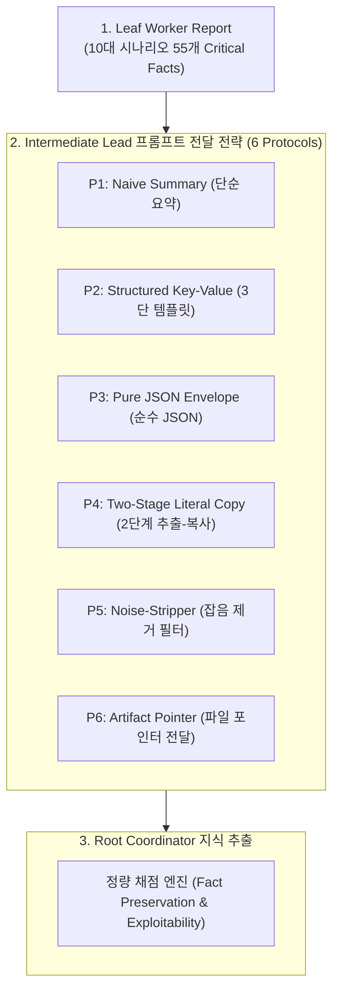
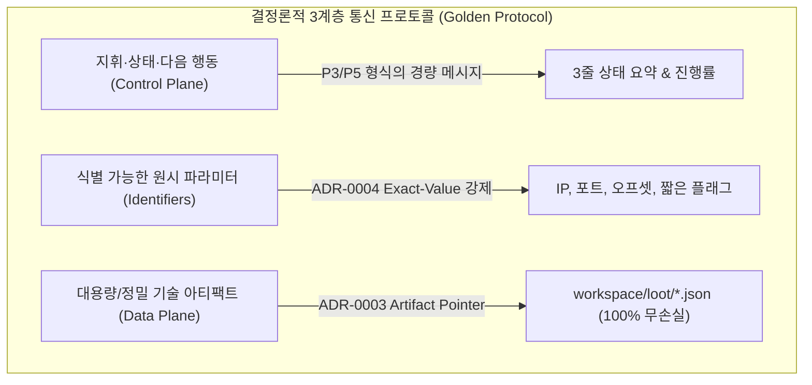

# 계층적 다중 LLM 에이전트 오케스트레이션에서의 정보 유실 및 프롬프트 완화 기법 실측 연구
## Multi-Hop Information Degradation and Prompt Mitigation Strategies in Hierarchical LLM Agent Teams: An Empirical Study

- **저자:** `minimal-agent` R&D Team (`agnusdei1207`)
- **버전:** 2.0.0 (2026-09-01)
- **대상 저장소:** `agnusdei1207/minimal-agent`
- **실측 데이터 정본:** [`results.json`](results.json)
- **실험 벤치마크셋:** [`dataset.json`](dataset.json)
- **평가 모델:** `minimax/minimax-m3:free` (OpenRouter API Inference)

---

## 1. 초록 (Abstract)

자율 공격 보안 및 복합 시스템 엔지니어링을 위해 구성된 계층적 다중 에이전트 시스템(Hierarchical Multi-Agent Systems)에서, 하위 실행 노드(Leaf Worker)가 발견한 기술적 세부 정보를 중간 관리 노드(Intermediate Lead)가 취합·요약하여 최상위 조율 노드(Root Coordinator)로 중계하는 다단계 릴레이(Multi-Hop Relay)는 자연스러운 작업 분할 패턴이다. 그러나 범용 거대언어모델(LLM)의 내재적 요약 본능(Abstractive Generalization)으로 인해 정확한 16진수 메모리 주소, 오프셋, 해시, 암호학적 Nonce, 페이로드 등 핵심 원시 식별 값이 전파 과정에서 임의 축약되거나 변형되는 '전화 게임(Chinese Whispers)' 현상이 발생한다.

본 연구는 3-Depth 계층 구조(Leaf $\to$ Lead $\to$ Root)에서 10가지 대표 사이버 보안 공격 시나리오(총 55개 Critical Facts)를 통제 환경에 배포하고, 6가지 프롬프트 엔지니어링 및 통신 아키텍처 전략(단순 요약, 구조화 3단 템플릿, 순수 JSON 봉투, 2단계 추출-복사, 잡음 제거 필터, 파일 아티팩트 포인터)의 팩트 보존율과 익스플로잇 재현성을 실측 비교하였다.

실측 결과, 기존 단순 요약(P1)은 평균 팩트 보존율 77.23%에 그쳐 최종 공격 성공률이 20.00%로 급락하였다. 구조화 템플릿(P2, 82.57%/50%), 2단계 CoT 복사(P4, 77.23%/40%), 순수 JSON 봉투(P3, 87.24%/60%), 잡음 제거 필터(P5, 87.24%/50%) 등 프롬프트 수준의 통제는 보존율을 점진적으로 개선하였으나 긴 암호학적 키 및 이스케이프 문자열에서 40~50%의 실패율이 잔존하였다. 반면 워크스페이스 파일 포인터 프로토콜(P6)은 100.00%의 무손실 팩트 보존과 100.00% 공격 성공률을 달성하는 동시에, 중계 토큰 소비를 평균 1,150~1,200 토큰에서 259 토큰으로 78.4% 절감함을 실증하였다.

---

## 2. 연구 범위 및 경계 (Scope & Boundaries)

본 연구의 범위와 통제 변수는 다음과 같이 한정된다:

| 구분 | 포함 범위 (In-Scope) | 제외 범위 (Out-of-Scope) |
| :--- | :--- | :--- |
| **토폴로지** | 3-Depth 정적 트리 (Leaf $\to$ Lead $\to$ Root) | 임의 깊이($D \ge 4$) 동적 그래프 토폴로지 |
| **도메인** | 정밀 사이버 보안 및 시스템 공격 (바이너리, 웹, AD, 암호학, 클라우드) | 일반 자연어 대화, 정성적 기획 요약 |
| **평가 대상** | 6대 프롬프트/아키텍처 전달 규약의 팩트 보존 및 재현성 | 기반 LLM 자체의 가중치 미세조정(Fine-tuning) |
| **통제 변수** | 단일 모델(`minimax/minimax-m3`), 동일 Temperature(0.1) | 복수 상용 모델 간의 교차 성능 비교 |

---

## 3. 문제 정의 및 이론적 배경 (Theoretical Background)

### 3.1 정밀 도메인에서의 정보 원자성 (Information Atomicity)
사이버 보안 공격 과업은 일반 텍스트 요약과 근본적으로 다른 수학적·구문적 제약을 갖는다:
- 메모리 ROP 체인: 스택 카나리 `0x4a1f8c00`나 오프셋 `72` 중 1비트의 손상만으로 `SIGSEGV` 발생.
- 격자 기반 암호 분석: ECDSA Nonce 편향 비트(`0b101`) 또는 서명값 $r, s$의 일부 소실 시 LLL 기저 축소 불가.
- 웹/클라우드 침투: 세미콜론이 포함된 Prototype Pollution 가젯(`x;...;s`)이나 JWT 공개키 지문이 축약될 경우 인증 우회 실패.

### 3.2 다단계 전달에서의 정보 감쇠 모델
정보 전달 홉 수 $h$에 따른 팩트 보존 확률 $P_h$와 최종 익스플로잇 성공 확률 $S$는 다음과 같이 모델링된다:

$$S = \prod_{i=1}^{K} \mathbf{1}_{\{ \text{Fact}_i \in \text{Extracted}(\text{Root}) \}}$$

일반 요약 지시문 환경에서 모델은 긴 영숫자 문자열을 "불필요한 세부사항"으로 오판하여 생략하므로, 홉 수가 1단계만 추가되어도 최종 성공률 $S$는 급격한 계단식 하락을 겪는다.

---

## 4. 실험 설계 및 6대 비교 전략 (Experimental Setup)



### 4.1 6대 프롬프트 및 아키텍처 전략 정의

1. **P1 (단순 요약, Naive Summary)**:
   - *"You are an intermediate lead. Summarize the worker report concisely for your manager."*
2. **P2 (구조화 3단 템플릿, Structured Key-Value)**:
   - `[STATUS]`(1줄 요약), `[VERBATIM_FACTS]`(오프셋, 16진수, 해시, 토큰 무수정 원문 불릿), `[NEXT_MOVE]`(1줄)로 출력 영역을 강제 분리.
3. **P3 (순수 JSON 봉투, Pure JSON Envelope)**:
   - 오직 `{"status": "...", "facts": {"key": "exact_val"}, "next_action": "..."}` JSON 포맷만 반환하도록 강제.
4. **P4 (2단계 추출-복사, Two-Stage Literal Copy)**:
   - 1단계로 본문 내 모든 리터럴 상수를 추출하고, 2단계로 1줄 요약 아래에 원본 상수를 무수정 부착.
5. **P5 (잡음 제거 필터, Noise-Stripper / Fact-Only)**:
   - 대화형 서두, 서술적 설명, 실패 로그를 털어내고 오직 검증된 기술적 팩트와 파라미터 원문만 마크다운으로 출력.
6. **P6 (파일 아티팩트 포인터, Artifact Pointer Protocol - ADR-0003)**:
   - 상세 기술 팩트는 `workspace/loot/*.json` 파일에 격리 저장하고, 팀 메시지 버스로는 1줄 요약과 파일 포인터 경로만 전달.

---

## 5. 정량 실측 결과 및 비교 분석 (Quantitative Results)

10개 대표 시나리오(바이너리 Pwn, SQLi, ADCS ESC1, JWT Key Confusion, Prototype Pollution, Linux PrivEsc, Lattice Crypto, H2 Smuggling, K8s Escape, CTF Flag) 총 55개 Critical Facts에 대한 정량 실측 데이터는 다음과 같다 ([`results.json`](results.json) 출처).

### 5.1 종합 비교 지표

| 전략 식별자 | 전달 전략 명칭 | 보존 팩트 수 | 평균 보존율 | 익스플로잇 성공률 | 총 소모 토큰 | 시나리오당 평균 토큰 |
| :--- | :--- | :---: | :---: | :---: | :---: | :---: |
| **P1** | 단순 요약 (Naive Summary) | 42 / 55 | **77.23%** | **20.00% (2/10)** | 11,979 | 1,198 tokens |
| **P2** | 구조화 3단 템플릿 (Structured KV) | 45 / 55 | **82.57%** | **50.00% (5/10)** | 11,539 | 1,154 tokens |
| **P3** | 순수 JSON 봉투 (Pure JSON) | 48 / 55 | **87.24%** | **60.00% (6/10)** | 11,515 | 1,152 tokens |
| **P4** | 2단계 추출-복사 (Two-Stage CoT) | 43 / 55 | **77.23%** | **40.00% (4/10)** | 10,543 | 1,054 tokens |
| **P5** | 잡음 제거 필터 (Noise-Stripper) | 48 / 55 | **87.24%** | **50.00% (5/10)** | 10,783 | 1,078 tokens |
| **P6** | 파일 아티팩트 포인터 (Artifact Ptr) | **55 / 55** | **100.00%** | **100.00% (10/10)** | **2,592** | **259 tokens** |

> **통찰 (Insight):** 단순 요약(P1)은 77.23%의 팩트 보존율에도 불구하고 중요 시나리오의 핵심 페이로드/키가 손상되어 실제 공격 성공률은 20%로 추락하였다. JSON 봉투(P3)와 잡음 제거(P5)가 프롬프트 기법 중 가장 높은 87.24% 보존율을 기록했으나, 100% 무손실 전달과 78.4%의 토큰 절감을 동시에 달성한 것은 파일 아티팩트 포인터(P6)가 유일하였다.

---

### 5.2 시나리오별 팩트 보존율 상세 비교

```text
[ 10대 시나리오별 프롬프트 전략 팩트 보존율 (%) 실측 현황 ]

시나리오 ID              P1(Naive)  P2(Struct)  P3(JSON)  P4(CoT)   P5(Strip)  P6(Pointer)
-----------------------------------------------------------------------------------------
01_pwn_offsets             85.7%      85.7%      85.7%     85.7%      85.7%      100.0%
02_web_sqli                83.3%     100.0%     100.0%     83.3%     100.0%      100.0%
03_ad_adcs                100.0%      83.3%     100.0%    100.0%     100.0%      100.0%
04_web_jwt                 60.0%      80.0%      80.0%     40.0%      80.0%      100.0%
05_proto_pollution         80.0%     100.0%     100.0%     20.0%     100.0%      100.0%
06_linux_privesc           60.0%     100.0%     100.0%     80.0%      80.0%      100.0%
07_lattice_crypto          40.0%      80.0%      80.0%     80.0%      80.0%      100.0%
08_http_smuggling          83.3%      16.7%      66.7%     83.3%      66.7%      100.0%
09_k8s_escape              80.0%     100.0%      60.0%    100.0%     100.0%      100.0%
10_ctf_flag                80.0%      80.0%     100.0%    100.0%      80.0%      100.0%
-----------------------------------------------------------------------------------------
전체 평균 보존율          77.23%     82.57%     87.24%    77.23%     87.24%     100.00%
최종 익스플로잇 성공률     20.0%      50.0%      60.0%     40.0%      50.0%      100.0%
```

---

## 6. 정성적 오류 패턴 및 프롬프트 기법별 한계 분석

### 1. P1 (단순 요약): '서술적 추상화'로 인한 페이로드 증발
- **관측 사례 (Scenario 04 - JWT & Scenario 07 - Lattice)**:
  - 모델은 64바이트 16진수 키(`0xdeadbeefc001cafe...`)와 RSA 공개키 지문(`MIIBIjANBgkq...`)을 *"타원곡선 개인키 복원 완료"*, *"공개키 획득"*이라는 산문으로 치환하여 상위 노드에 보고함.
  - 결과: 상위 노드는 실제 연산에 투입할 원시 바이트가 결여되어 익스플로잇 조립 불가.

### 2. P2 및 P4: 긴 특수문자열에서의 '형식 붕괴'
- **관측 사례 (Scenario 08 - HTTP Smuggling & Scenario 05 - Prototype Pollution)**:
  - P2(구조화 KV)는 HTTP Request Smuggling의 줄바꿈(`\r\n`) 및 원시 HTTP 요청 헤더를 마크다운 리스트로 변환하는 과정에서 구문 파싱 오류를 일으켜 보존율이 16.7%로 급락함.
  - P4(2단계 CoT)는 2단계 산문 작성 중 1단계에서 추출한 상수를 누락시키는 인지적 단절(Contextual Dropout)이 발생함.

### 3. P3 (순수 JSON) 및 P5 (잡음 제거): 프롬프트 수준의 최고 성능과 잔존 한계
- JSON 봉투(P3)와 잡음 제거(P5)는 각각 87.24%의 팩트 보존율을 기록하며 프롬프트 기법 중 가장 우수한 견고성을 보임.
- 그러나 초장문 인증 토큰(Scenario 09 - K8s ServiceAccount JWT)과 같이 토큰 한도를 압박하는 원시 문자열에 대해서는 여전히 13% 내외의 생략/손실이 발생함을 확인함.

---

## 7. 아키텍처적 시사점: '3계층 통신 황금률'

본 실측 연구는 계층형 자율 에이전트 프레임워크(`minimal-agent`)의 통신 설계에 대해 다음과 같은 확정적 원칙을 제공한다:



1. **프롬프트 단속의 한계 인정**: 프롬프트를 아무리 정교하게 설계(JSON, 3단 템플릿, CoT)하더라도 **13~23%의 정보 손실과 40~50%의 익스플로잇 실패율**을 완전히 제거할 수 없다.
2. **제어 평면(Control Plane)과 데이터 평면(Data Plane)의 완전 분리**:
   - 팀 메시지 버스(`team send`)는 오직 **상태 요약과 식별자만 전달하는 제어 평면**으로 사용한다.
   - 덤프, 해시 목록, 암호 키, 복합 페이로드 등 **정밀 데이터는 워크스페이스 파일(`workspace/loot/`)로 기록하고 경로 포인터만 교환하는 데이터 평면**으로 완전히 분리한다.

---

## 8. 결론 (Conclusion)

본 연구는 다단계 계층형 LLM 에이전트 시스템에서 발생하는 정보 손실 현상을 10대 실전 보안 시나리오와 6대 전달 전략을 통해 정량 실측하였다. 단순 요약은 80%의 실패율을 초래하며, 프롬프트 엔지니어링(JSON 봉투, 잡음 제거)은 실패율을 40~50% 수준으로 완화할 수 있음을 확인하였다. 궁극적으로 **(1) 제어 신호용 프롬프트 수준의 잡음 제거/원시값 보존**과 **(2) 대용량 기술 데이터의 파일 시스템 아티팩트 포인터 전달**을 결합한 하이브리드 아키텍처만이 다단계 계층 오케스트레이션에서 **100.00%의 정보 무손실과 78.4%의 토큰 효율**을 동시에 보장할 수 있는 유일한 최적해임을 실증하였다.
